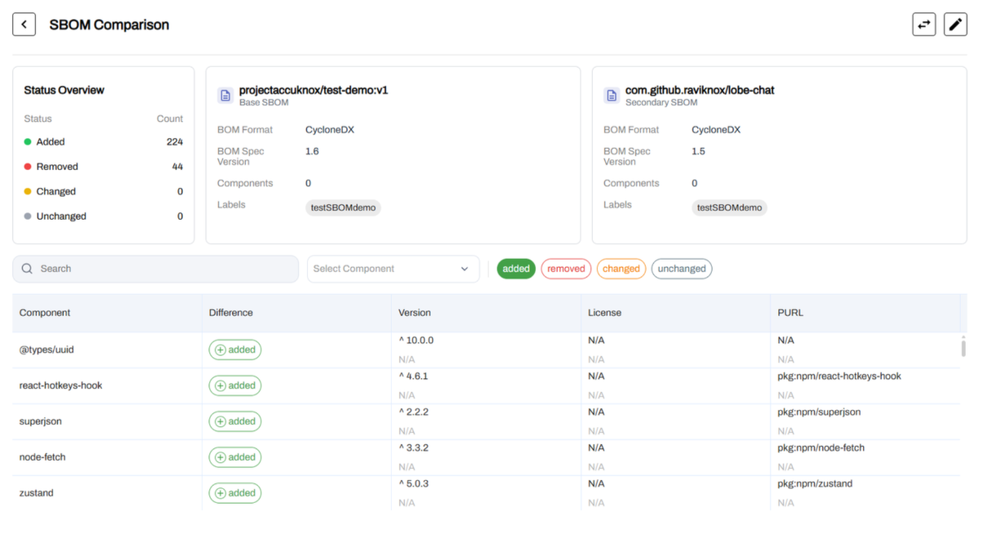
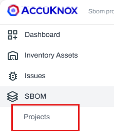
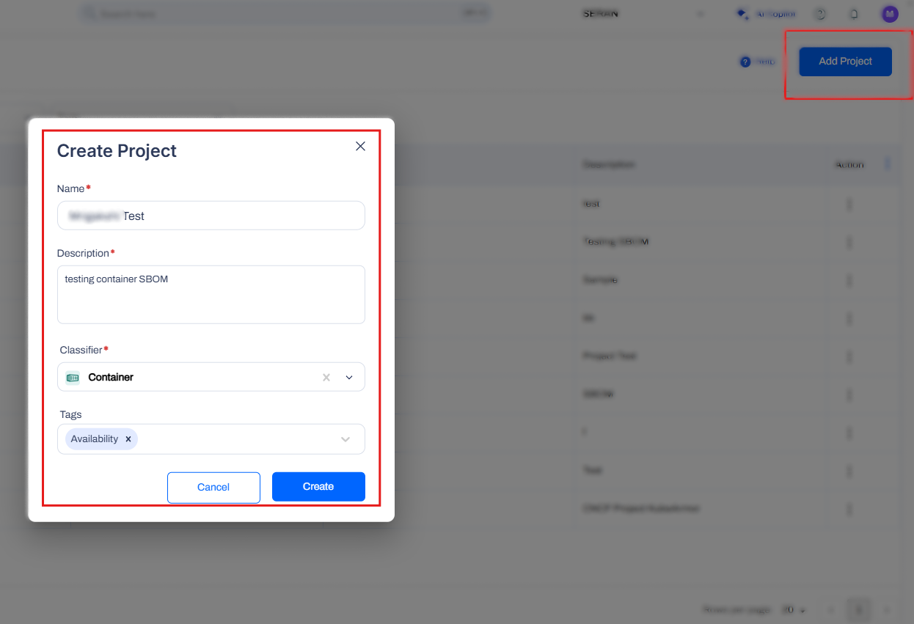
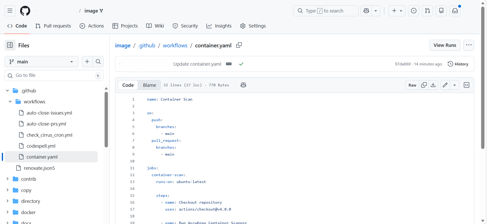
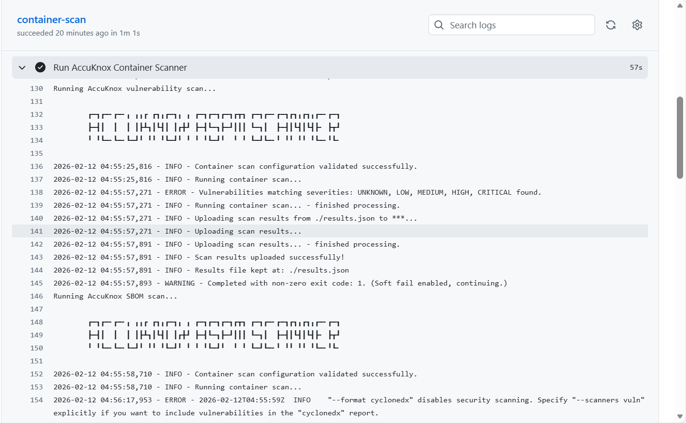
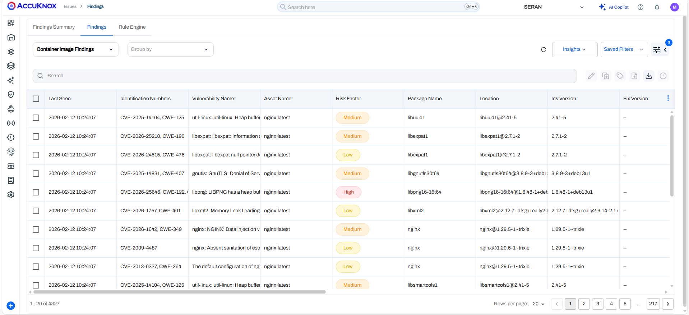
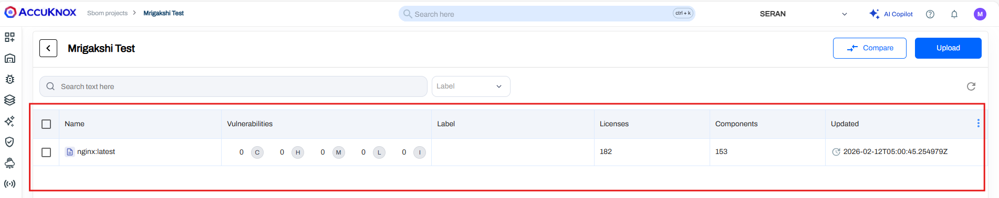

# Software Bill of Materials (SBOM)

This guide outlines how to onboard and use SBOMs in AccuKnox:

1. **Generate an SBOM** in a standard format (e.g., CycloneDX JSON).
2. **Upload or automate SBOM ingestion** into AccuKnox.
3. **Scan and analyze dependencies** using the AccuKnox platform.
4. **View, compare, and report** on results, including tracking changes and supply chain risks.

**Prerequisites:**

- Ability to generate SBOMs in a standard format
- Access to AccuKnox Console
- API Token (see Token Generation)
- Project Name (created in AccuKnox Console under SBOM → Projects)
- Label for organizing uploaded scan reports
- GitHub Secrets setup for sensitive credentials

---

## Container Scan and SBOM File Generation Using GitHub Actions

### Features

- **Automated Container Image Scanning:** Detect known vulnerabilities in container images during CI/CD execution.
- **SBOM Generation:** Generate and upload SBOMs for container images to support supply chain security and compliance requirements.
- **Severity-Based Enforcement:** Fail pipelines or block deployments based on configurable severity thresholds (e.g., HIGH, CRITICAL).



## Step-by-Step Guide

### Step 1: Create SBOM Project in AccuKnox UI

1. Navigate to **SBOM → Projects**.


2. Click on **Add Project**.


3. Enter the project name (must match the `project_name` in your workflow file), set the classifier (e.g., Container), add a description and tags, then click **CREATE**.

### Step 2: Configure GitHub Actions Workflow

1. Go to your GitHub repository.
2. Navigate to the `.github/workflows` folder (create it if it doesn't exist).
3. Create a new file: `containerscan.yml`.


```yaml
name: AccuKnox Container Scan Workflow

on:
  push:
    branches:
      - main
  pull_request:
    branches:
      - main

jobs:
  Container-scan:
    runs-on: ubuntu-latest
    steps:
      - name: Checkout repository
        uses: actions/checkout@v4.0.0
      - name: Run AccuKnox Container Scanner
        uses: accuknox/container-scan-action@latest
        with:
          accuknox_token: ${{ secrets.ACCUKNOX_TOKEN }}
          accuknox_label: ${{ secrets.ACCUKNOX_LABEL }}
          accuknox_endpoint: ${{ secrets.ACCUKNOX_ENDPOINT }}
          image_name: "test-nginx"
          tag: "latest"
          severity: "UNKNOWN,LOW,MEDIUM,HIGH,CRITICAL"
          soft_fail: true
          upload_results: true
          generate_sbom: true
          dockerfile_context: Dockerfile
          project_name: "Project Test"
```




> **Note:** The `project_name` in the workflow file must match the SBOM project name in AccuKnox Console to automatically map findings from container scan results to SBOM.

### Step 3: Trigger the Workflow

Push changes or create a pull request to run the workflow.



### Step 4: Review Results in AccuKnox UI

1. Navigate to **Findings → Issues Page** for container image findings.


2. Go to **SBOM → Projects → [Your Project Name]** to view SBOM results and comparisons.


---

**Sample Repository:**
You can fork and use [containers/image](https://github.com/containers/image) to work with container images for testing this scan.
