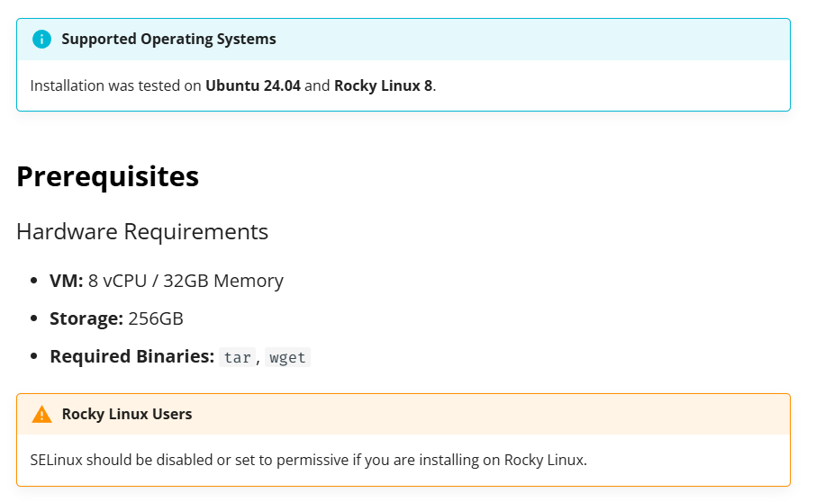

# AI-SPM – SaaS vs On-Prem Deployment

AccuKnox AI-SPM is available as a fully managed **SaaS** offering or a self-hosted **On-Premises** deployment. Both deliver identical features — choose based on your infrastructure, data-residency, and compliance requirements.

## Comparison

| | SaaS | On-Prem |
|---|---|---|
| **Features** | All AI-SPM features | Full feature parity with SaaS |
| **Deployment Method** | Helm Charts on cloud Kubernetes | Helm Charts on self-hosted Kubernetes or 3-node VM cluster |
| **Deployment Time** | Within minutes | 30 min – 4 hours |
| **Air-Gapped Support** | :x: | :white_check_mark: |
| **Scanning** | Collector model or automated scans | Collector model or automated scans |
| **Prompt Firewall** | :white_check_mark: | :white_check_mark: (AI Gateway or SDK) |
| **AI Runtime Detection & Response** | :white_check_mark: | :white_check_mark: |
| **Governance (MITRE ATLAS, OWASP LLM Top 10, NIST AI RMF, AVID)** | :white_check_mark: | :white_check_mark: |
| **Additional Components** | — | Neo4j database; GPUs optional (recommended for Prompt Firewall) |
| **Product Updates** | Automatic | Container images via `tar.gz`; customer-applied with AccuKnox support |
| **Infrastructure & DevOps** | AccuKnox managed | Customer managed |
| **High Availability & Observability** | AccuKnox managed | Customer managed |
| **Data Residency** | Results exportable to customer S3 (90-day retention); hosted on Sovereign Cloud with regional failover | Full local data ownership and residency |
| **Performance** | No difference | No difference |
| **Support** | Standard | AccuKnox Premium Support recommended |

!!! note "Network Requirement (On-Prem)"
    AI workloads must be able to reach the AccuKnox control plane. Endpoint whitelisting may be required depending on your network configuration.

## Prompt Firewall Deployment (On-Prem)

Two approaches are supported:

| Approach | How it works |
|---|---|
| **AI Gateway Integration** | Connect the Prompt Firewall to an AI Gateway (LiteLLM, Bifrost, AWS APIM, Azure APIM). |
| **SDK-based (Direct)** | Embed the firewall directly in your application — no gateway needed. |

## Hardware Prerequisites & Architecture (On-Prem)

### Minimum Hardware Requirements

### Architecture Overview

## On-Prem Onboarding Steps

Onboard existing AI assets in this order:

1. **LLM/ML Models** for Red Teaming
2. **AI Applications** for Red Teaming
3. **AI Applications** for Prompt Firewalling

!!! tip "Premium Support"
    AccuKnox Premium Support is available for on-prem deployments to assist with upgrades, patches, and operational guidance.

[SCHEDULE DEMO](https://www.accuknox.com/demo){ .md-button .md-button--primary }
[CONTACT US](https://www.accuknox.com/contact-us){ .md-button }
