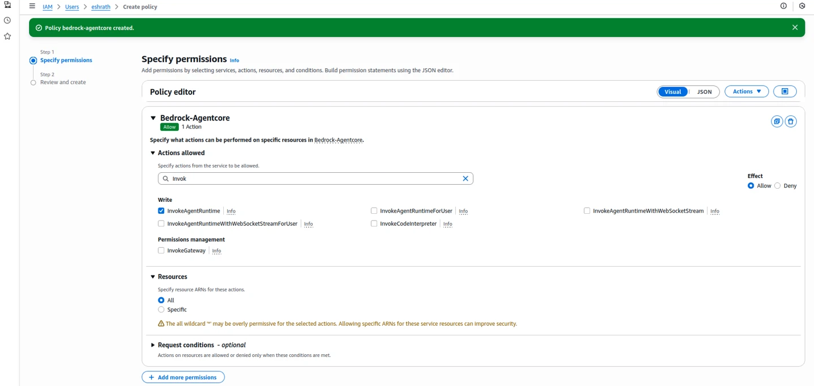

# Pre-requisite for AWS Cloud Account Onboarding

## CSPM Pre-requisite for AWS

When the AccuKnox control plane is hosted in a cloud environment, scanning is performed using Cloud account Readonly Access permissions.


AWS onboarding requires creating an IAM user. Follow these steps to provide the user with appropriate read access:

**Step 1:** Navigate to IAM → Users and click on Add Users


**Step 2:** Give a username to identify the user


**Step 3:** In the "Set Permissions" screen:

a. Select "Attach policies directly"

b. Search "ReadOnly", Filter by Type: "AWS managed - job function" and select the policy


c. Search "SecurityAudit", Filter by Type: "AWS managed - job function" and select the policy


**Step 4:** Finish creating the user. Click on the newly created user and create the Access key and Secret Key from the Security Credentials tab to be used in the AccuKnox panel


## Permissions for AI Asset Scanning (AWS)

### General Scan Permission (Required)

Create an **IAM User** and attach the following managed policies:

    * `ReadOnly` (AWS managed -- job function)
    * `SecurityAudit` (AWS managed -- job function)

### Permissions for Bedrock & SageMaker

Create an **inline policy** with the following permissions:

=== "Bedrock"

    ```json
    [
        "bedrock:InvokeModel",
        "bedrock:ListTagsForResource",
        "bedrock:InvokeAgent"
    ]
    ```

=== "SageMaker"

    ```json
    [
        "sagemaker:InvokeEndpoint",
        "sagemaker:ListTags"
    ]
    ```

=== "Bedrock AgentCore"

    ```json
    [
        "bedrock-agentcore:GetEvaluator",
        "bedrock-agentcore:InvokeAgentRuntime",
        "bedrock-agentcore:ListPolicies",
        "bedrock-agentcore:ListOnlineEvaluationConfigs",
        "bedrock-agentcore:ListPolicyEngines",
        "bedrock-agentcore:GetPolicyEngine",
        "bedrock-agentcore:ListTagsForResource",
        "bedrock-agentcore:GetOnlineEvaluationConfig",
        "bedrock-agentcore:ListEvaluators",
        "bedrock-agentcore:GetPolicy",
        "bedrock-agentcore:StopRuntimeSession"
    ]
    ```

=== "AWS Marketplace"

    !!! note
        Required for invoking certain models (e.g., Claude Opus 4.5).

    ```json
    [
        "aws-marketplace:Subscribe",
        "aws-marketplace:ViewSubscriptions"
    ]
    ```

## Configure IAM User for AI Asset Scanning (AWS)

1. Navigate to **IAM > Users > Create User**.
2. Select the AWS managed policies **ReadOnlyAccess** and **SecurityAudit** to attach to the user.
3. Go to **Add Permissions > Create inline policy**.
    * **For AgentCore permissions**, add an additional inline policy by selecting the service **Bedrock-Agentcore**.
    * Allow the required read and runtime actions (including `InvokeAgentRuntime`, `GetEvaluator`, `GetPolicy`, `GetPolicyEngine`, `GetOnlineEvaluationConfig`, `StopRuntimeSession`, and the corresponding `List*` actions such as `ListPolicies`, `ListPolicyEngines`, `ListEvaluators`, `ListOnlineEvaluationConfigs`, and `ListTagsForResource`).
    * Set **Resources** to **All**.

        

        

        

4. For **SageMaker Permissions**, add another set of permissions by selecting the service **SageMaker**, allowing the actions **InvokeEndpoint** and **ListTags**, and choosing **All** under resources.
5. For **Bedrock Permissions**, select the service **Bedrock**, allow the actions **InvokeModel**, **ListTagsForResource**, and **InvokeAgent**, and choose **All** under resources.
6. For **AWS Marketplace Permissions** (required for invoking certain models, e.g., Claude Opus 4.5), select the service **AWS Marketplace**, allow the actions **Subscribe** and **ViewSubscriptions**, and choose **All** under resources.
7. Finally, review and create the policy to attach it to the IAM user.

- - -
[SCHEDULE DEMO](https://www.accuknox.com/contact-us){ .md-button .md-button--primary }
