---
title: DAST Authenticated Scan
description: Configure authenticated scans in AccuKnox DAST to test protected content behind login pages using credentials, session indicators, and a fallback URL.
---

# DAST Authenticated Scan

AccuKnox Dynamic Application Security Testing (DAST) supports **authenticated scans**, enabling the crawler to access and test content behind login pages. The system visualises the session state with **Logged In**, **Logged Out**, and **Fallback** indicators — preventing false negatives where crawlers fail to reach protected content.

!!! tip "Unauthenticated scans"
    If you only need to scan publicly accessible pages without supplying credentials, see [DAST Unauthenticated Scan](dast-scan-no-auth.md).

---

## Configuration Steps

**Step 1:** Log in to the AccuKnox Platform.

**Step 2:** Navigate to **Settings** > **Collectors**.

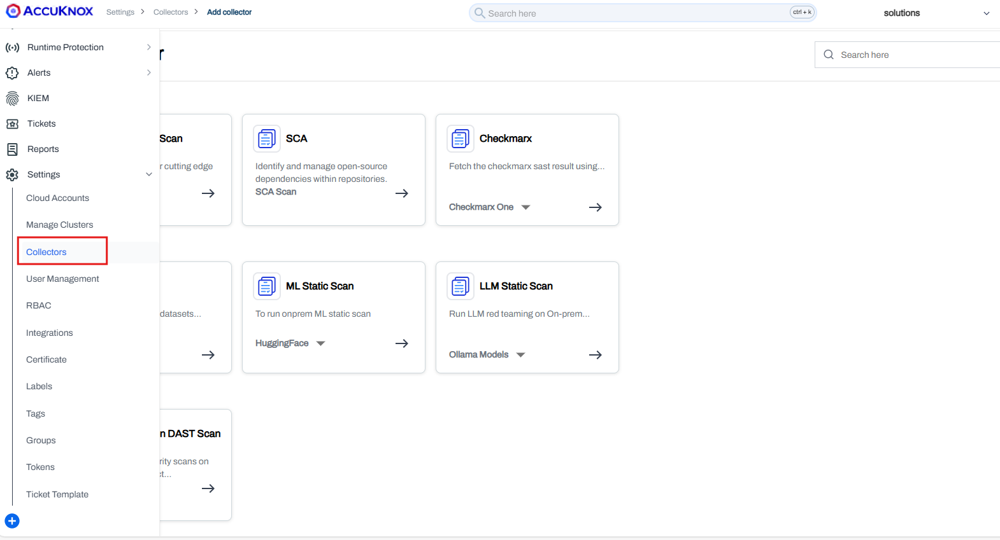

**Step 3:** Click **Add Collector**.

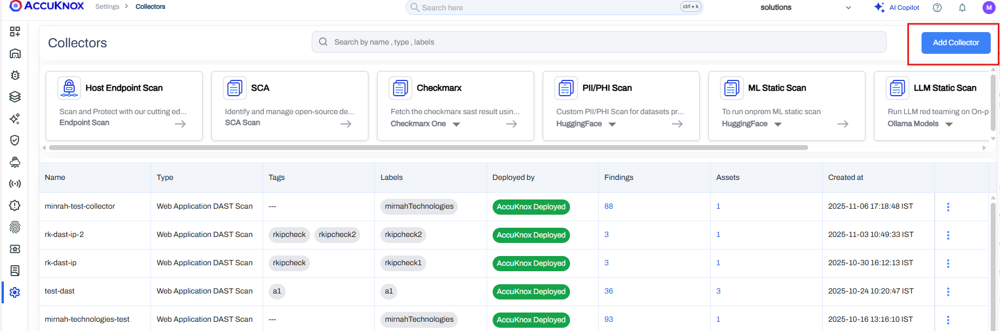

**Step 4:** Click **Web Application DAST Scan**.

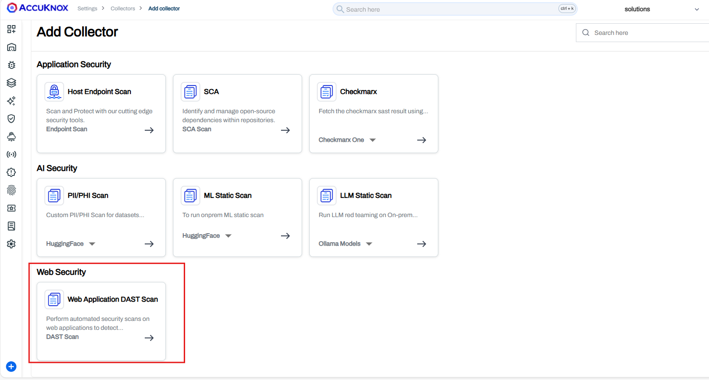

**Step 5:** Add the collector name and proceed to configure the following fields:

### Target URL

**Enter Target URL** — Primary target URL to scan.

### Scan Type

**Scan Type** — Select **Baseline** (quick scan) or **Full** (detailed scan).

### Authentication

**Authentication** — Select **Auth-based**.

### Login Page URL

**Login Page URL** — The URL of the application's login page where the user enters credentials.

Example: `https://ctflearn.com/`

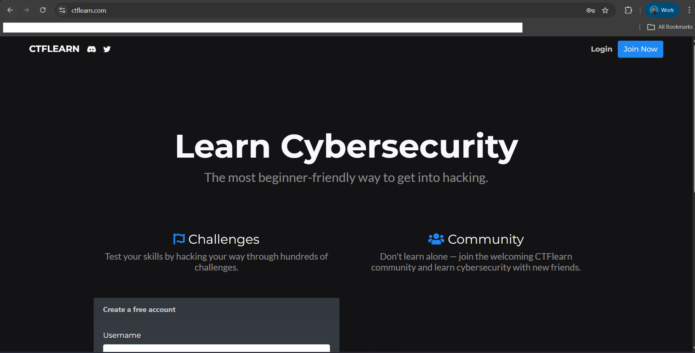

### Login Credentials

**Login Credentials** — Valid username and password used to authenticate the scan against the application.

Example: Username: `admin`, Password: `admin`

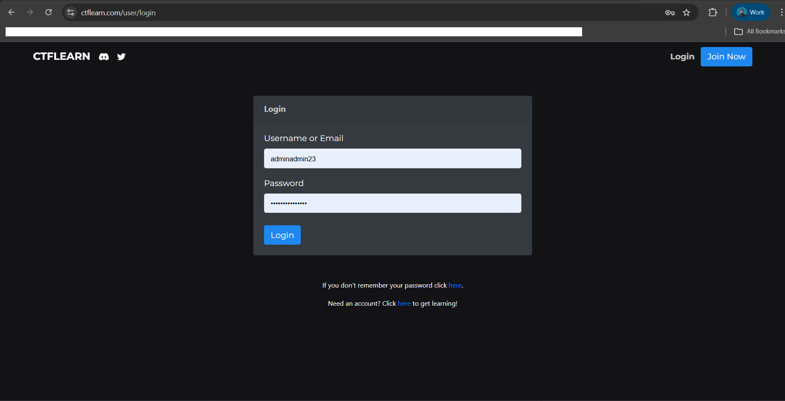

### Include Path

**Include Path** *(Optional)* — Defines the specific URLs or URL patterns to include in the scan scope.

Example: `https://ctflearn.com/lab/`

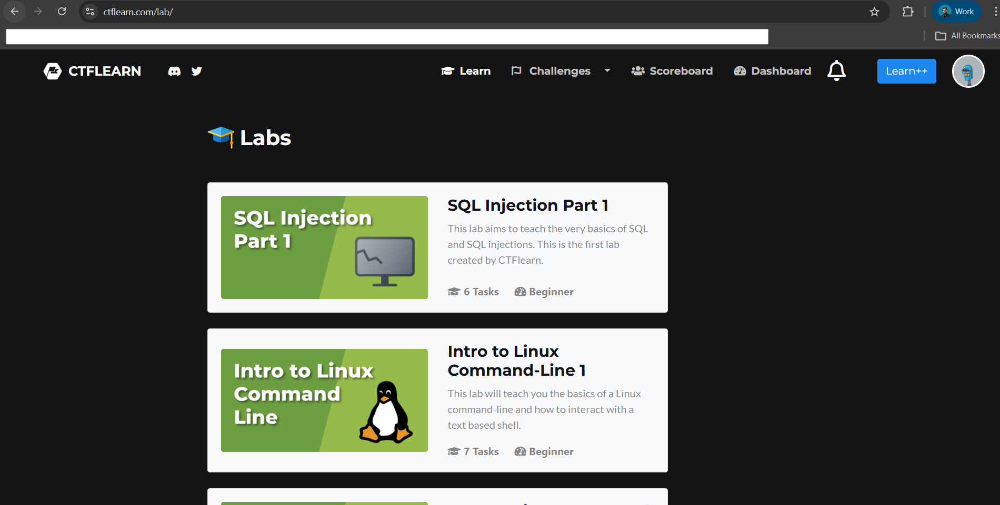

### Exclude Path

**Exclude Path** *(Optional)* — URLs or URL patterns that should be excluded from the scan to avoid scanning specific pages or actions.

Example: `https://ctflearn.com/1/scoreboard/0`

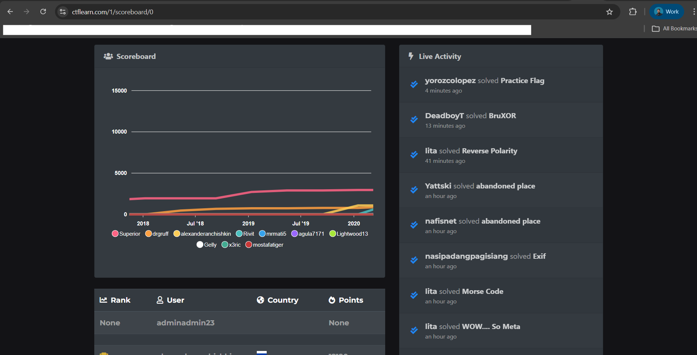

### Logged In Indicator

**Logged In Indicator** — Keyword or phrase used to confirm a successful login during the scan.

Example: `Dashboard`, `Get Started`

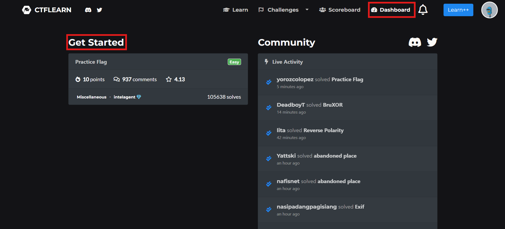

### Logged Out Indicator

**Logged Out Indicator** — Keyword or phrase indicating the user is logged out or the session has expired.

Example: `Login`, `Learn`

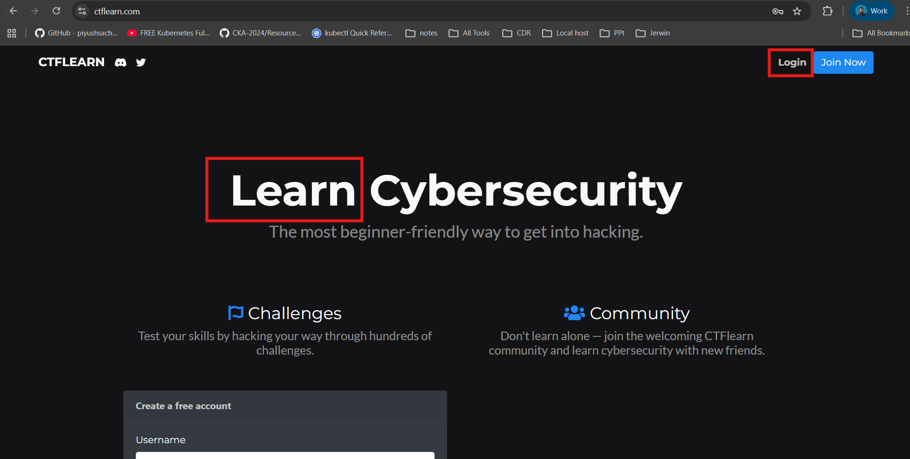

### Login Fallback URL

**Login Fallback URL** — Post-login page used to verify a successful login.

Example: `https://ctflearn.com/dashboard`

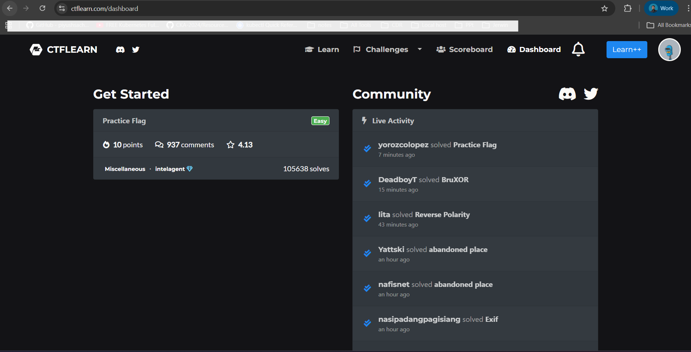

### Label & Tags

**Label** — Create one using these steps: [Create Labels](https://help.accuknox.com/how-to/how-to-create-labels/)

**Tags** *(Optional)* — Add any relevant tags.

See the difference between Baseline and Full scan modes here: [Baseline vs Full Scan](https://help.accuknox.com/how-to/dast-baseline-vs-full/)

Here is an example of how it looks after you have added everything:

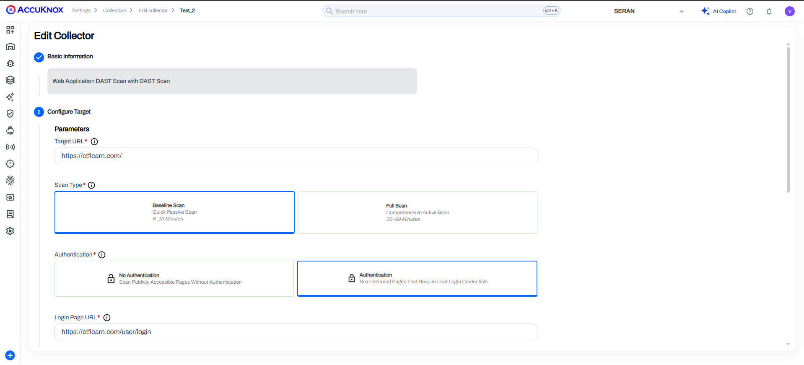

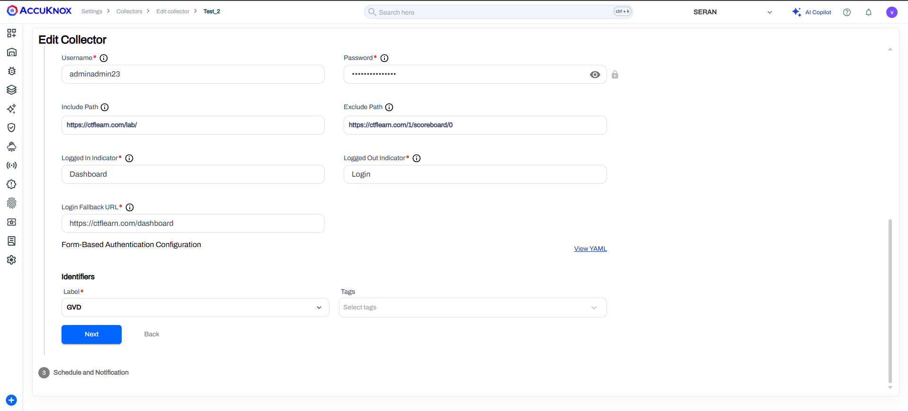

**Step 6:** Enter your email address where you would like to receive scan notifications and press **Enter**.

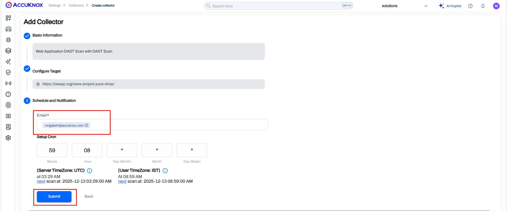

**Step 7:** After submitting, the scan will be triggered. You can check the scan results on the same page.

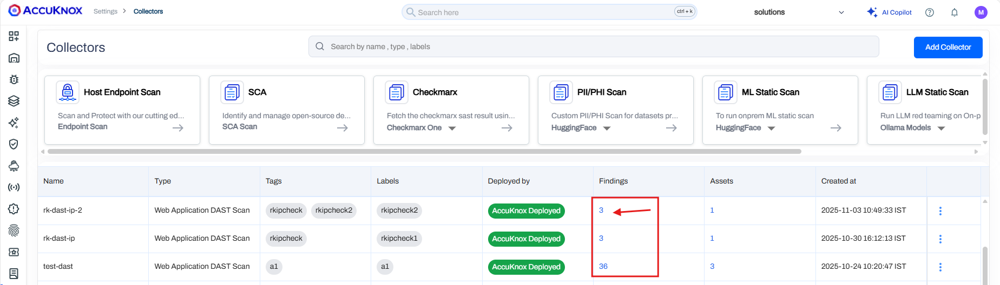

**Step 8:** Once the **Findings** column is populated, click on it to be redirected to the findings page with all necessary details.

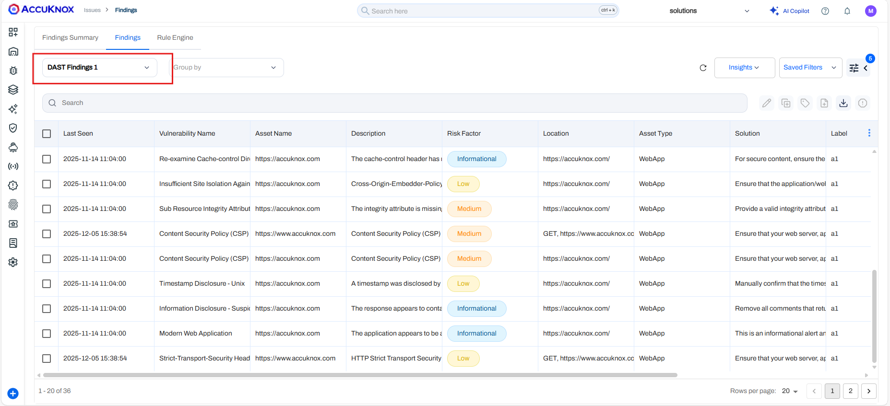