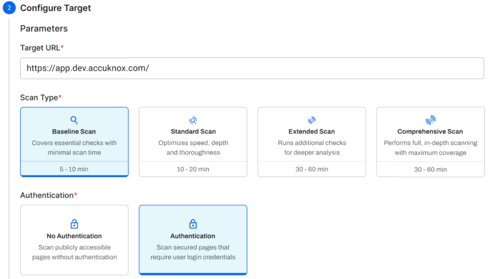
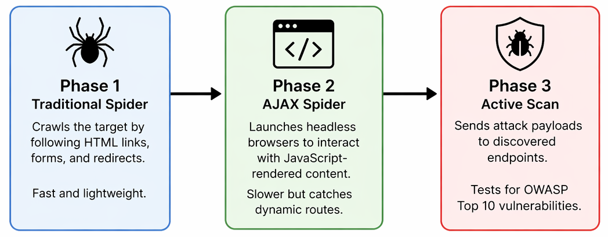

# DAST Scan Types

AccuKnox DAST uses an automation-driven scanning framework to perform dynamic application security testing. Four scan types are available, each controlling three core components: the Traditional Spider, the AJAX Spider, and the Active Scanner. Choose a scan type based on your development stage and the coverage depth you need.



---

## How Scanning Works

DAST scanning runs in three sequential phases:



!!! info ""
    **Baseline** skips Phase 3 entirely. All other scan types run all three phases.

---

## Scan Type Comparison

| Parameter | Baseline | Standard | Extended | Comprehensive |
| --------- | -------- | -------- | -------- | ------------- |
| **Spider maxDuration** | 10 min | 10 min | 10 min | 20 min |
| **Spider maxChildren** | 50 | 30 | 50 | 50 |
| **Spider maxDepth** | 5 | 5 | 5 | 5 |
| **AJAX maxCrawlDepth** | 10 | 5 | 10 | 10 |
| **AJAX maxDuration** | 10 min | 10 min | 10 min | 20 min |
| **AJAX browsers** | 4 | 4 | 4 | 4 |
| **Active Scan** | ❌ No | ✅ Yes | ✅ Yes | ✅ Yes |
| **Scan Duration** | N/A | 20 min | 60 min | 100 min |
| **Policy** | N/A | Dev CICD | Dev Standard | Dev Full |
| **Rule Duration** | N/A | Unlimited | Unlimited | Unlimited |


---

## Baseline Scan

The **Baseline Scan** is designed for high-frequency testing where speed and safety are paramount. It is a non-invasive, passive-only scan — both spiders run, but no attack payloads are ever sent.

- **Mechanism:** Crawls with both the Traditional Spider and AJAX Spider, then performs passive analysis only. No active attack payloads are sent.
- **Vulnerability Focus:** Misconfigurations, missing security headers, information disclosure, and cookie security issues.
- **Estimated Duration:** 2 – 5 minutes.

!!! tip "Best Used For"
    Every commit/PR in CI/CD, production scanning, and the first scan on a new target — anywhere speed and zero application risk are required.

??? abstract "Passive Security Baseline Audit Details"
    A rapid, non-intrusive scan that crawls the application with both spiders and performs passive analysis only — no attack payloads are sent. It checks for missing security headers (`Content-Security-Policy`, `X-Frame-Options`, `X-Content-Type-Options`), insecure cookie flags (`Secure`, `HttpOnly`, `SameSite`), information disclosure in headers or error messages, insecure form fields, and exposed stack traces. Rules are categorized by severity so warnings can be promoted to failures or suppressed as needed. Safe for production and optimized for CI/CD pipelines.

## Standard Scan

The **Standard Scan** runs both spiders with conservative limits, then performs an active scan using the **Dev CICD** policy.

- **Mechanism:** Both spiders run with tighter crawl limits to keep duration predictable, followed by a targeted active scan.
- **Vulnerability Focus:** SQL injection, reflected XSS, path traversal, CSRF, plus all passive findings.
- **Estimated Duration:** 15 – 30 minutes.

!!! tip "Best Used For"
    Nightly/weekly CI/CD pipelines, pre-release gates in staging, and dev branch validation.

---

## Extended Scan

The **Extended Scan** increases crawl depth for better endpoint coverage, then runs the **Dev Standard** policy for a 60-minute active scan.

- **Mechanism:** Higher `maxChildren` (50) and AJAX `maxCrawlDepth` (10) ensure deeper discovery before the active scan begins.
- **Vulnerability Focus:** Same vulnerability classes as Standard, but with significantly better endpoint coverage on complex applications.
- **Estimated Duration:** 60 – 90 minutes.

!!! tip "Best Used For"
    Single-page applications (SPAs), complex JavaScript apps, deep admin panels, and biweekly assessments.

---

## Comprehensive Scan

The **Comprehensive Scan** provides maximum coverage. The spider runs for 20 minutes and the active scan uses the **Dev Full** policy for up to 100 minutes.

- **Mechanism:** Maximum spider duration and crawl depth, followed by the most thorough active scan policy available.
- **Vulnerability Focus:** Edge-case vulnerabilities, timing-based attacks, and rarely accessed paths — in addition to all Standard/Extended findings.
- **Estimated Duration:** 2 – 3 hours.

!!! tip "Best Used For"
    Quarterly audits, SOC 2/PCI compliance prep, pen test supplementation, and new application onboarding.

??? abstract "Advanced Active Penetration Testing Rules Details"
    A deep-dive assessment that actively sends malicious payloads to mimic a real-world attacker. It tests for injection flaws (SQL/NoSQL, OS Command, SSTI, XXE), client-side attacks (reflected and stored XSS, CSRF), broken access control (Path Traversal, RFI, SSRF), and infrastructure issues (Buffer Overflows, Insecure File Uploads, Cloud Metadata Leakage). Each input is tested with hundreds of payload variations to bypass WAF filters, and attack patterns are adapted to the detected technology stack (Java, PHP, .NET, etc.). Findings are ranked by severity to prioritize remediation. Sends active attack traffic — recommended for staging or development environments only.

---

## YAML Configuration Reference

AccuKnox DAST scans are driven by a single YAML configuration file. Below is a complete example using the **Standard** scan type. Adjust the `maxDuration`, `maxChildren`, `maxCrawlDepth`, `maxScanDurationInMins`, and `policy` values to match your chosen scan type from the comparison table above.

### Example YAML

```yaml
---
env:
  contexts:
  - name: "accuknox-dast"
    urls:
    - "https://your-app.example.com"
    includePaths:
    - "https://your-app.example.com.*"
    excludePaths:
    - ".*\\.css"
    - ".*\\.js"
    - ".*\\.png"
    - ".*\\.jpg"
    - ".*\\.woff2"

jobs:
- type: spider
  parameters:
    maxDuration: 10
    maxChildren: 30
    maxDepth: 5

- type: spiderAjax
  parameters:
    maxCrawlDepth: 5
    maxDuration: 10
    numberOfBrowsers: 4

- type: passiveScan-wait
  parameters:
    maxDuration: 5

- type: activeScan
  parameters:
    maxScanDurationInMins: 20
    policy: "Dev CICD"
    maxRuleDurationInMins: 0

- type: report
  parameters:
    template: "traditional-json"
    reportDir: "/dast/wrk"
    reportFile: "scanreport.json"
```

### Configuration Block Reference

| Block | What It Does |
| ----- | ------------ |
| `env.contexts.urls` | The target URL to scan. Replace with your application URL. |
| `includePaths` | Regex patterns for URLs that should be tested. Typically your app domain with a wildcard. |
| `excludePaths` | Regex patterns for URLs to skip. Always exclude static assets (`.css`, `.js`, `.png`, `.woff2`) to reduce scan noise and time. |
| `failOnError` | When `true`, exits with an error code if any job fails. Enable in CI/CD pipelines so failed scans block the build. |
| `spider` | Crawls your app by following HTML links. `maxDuration` caps run time; `maxChildren` limits links per page; `maxDepth` controls how deep it goes. |
| `spiderAjax` | Opens real headless browsers to navigate JavaScript-rendered pages, SPAs, and dynamic routes the HTML spider cannot see. |
| `passiveScan-wait` | Waits for passive analysis of collected traffic without sending attack payloads. |
| `activeScan` | Sends attack payloads to every discovered endpoint. The `policy` field controls which vulnerability rules run. **Remove this block entirely for a Baseline scan.** |
| `report` | Generates the JSON output file that gets uploaded to AccuKnox. |

---

