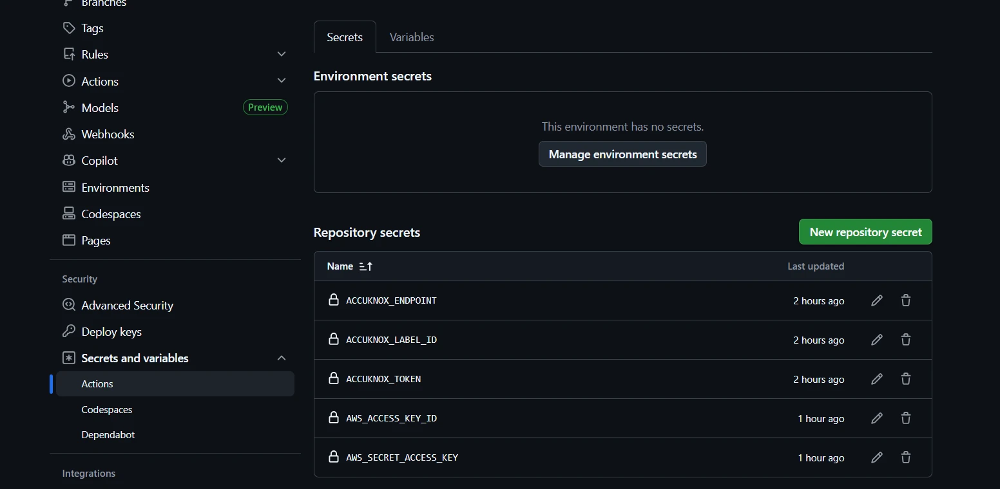
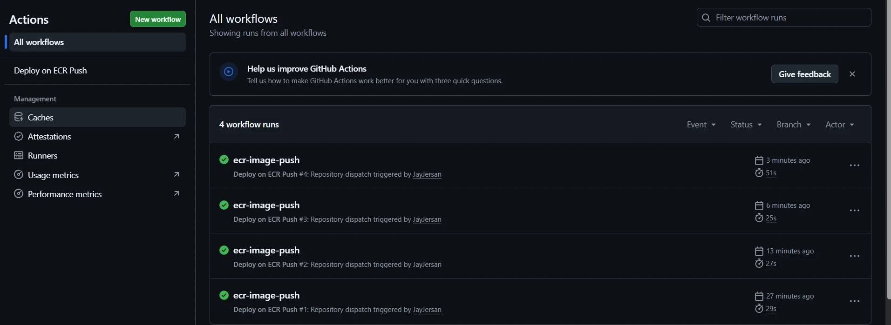

# Automated Container Image Scan in ECR

This guide walks you through building an **event-driven scanning pipeline** that triggers an AccuKnox container image scan automatically whenever a new image is pushed to Amazon ECR.

When a push event occurs, an EventBridge rule invokes a Lambda function that fires a `repository_dispatch` event on your GitHub repository. This kicks off a GitHub Actions workflow that pulls the image and runs the AccuKnox ASPM scanner — with results delivered directly to your AccuKnox dashboard.

## Prerequisites

- AWS account with permissions to manage IAM roles, Lambda functions, and EventBridge rules
- GitHub repository and a Personal Access Token (PAT) with `repo` scope
- AccuKnox account with a valid API token, label ID, and endpoint URL

---

## Configuration

### Terraform

Copy the following files into a new local directory:

```
main.tf
outputs.tf
variables.tf
```

Create a `terraform.tfvars` file in the same directory and populate it with your environment-specific values:

```hcl
aws_region   = "us-east-1"
github_token = "ghp_"
github_owner = "J**"
github_repo  = "***"
```

Then initialize and deploy the resources:

```bash
terraform init
terraform plan
terraform apply
```

This provisions the EventBridge rule and Lambda function that detect ECR push events and trigger your GitHub Actions workflow.

---

### GitHub Actions

In your GitHub repository, create a workflow file at `.github/workflows/ecr-scan.yml` with the following content:



```yaml
name: Scan on ECR Push
on:
  repository_dispatch:
    types: [ecr-image-push]
jobs:
  container-scan:
    runs-on: ubuntu-latest
    timeout-minutes: 40
    steps:
      - name: Checkout
        uses: actions/checkout@v4

      - name: Configure AWS
        uses: aws-actions/configure-aws-credentials@v2
        with:
          aws-access-key-id: ${{ secrets.AWS_ACCESS_KEY_ID }}
          aws-secret-access-key: ${{ secrets.AWS_SECRET_ACCESS_KEY }}
          aws-region: ${{ github.event.client_payload.region }}

      - name: Login to ECR
        id: login-ecr
        uses: aws-actions/amazon-ecr-login@v1

      - name: Validate payload
        run: |
          if [ -z "${{ github.event.client_payload.image_url }}" ]; then
            echo "Missing image_url"
            exit 1
          fi

      - name: Print ECR details
        run: |
          echo "Repository : ${{ github.event.client_payload.repository_name }}"
          echo "Tag        : ${{ github.event.client_payload.image_tag }}"
          echo "Digest     : ${{ github.event.client_payload.image_digest }}"
          echo "Image URL  : ${{ github.event.client_payload.image_url }}"

      - name: Pull image from ECR
        run: |
          docker pull ${{ github.event.client_payload.image_url }}

      - name: Download ASPM Scanner
        run: |
          curl -L https://github.com/accuknox/aspm-scanner-cli/releases/download/v0.14.0/accuknox-aspm-scanner -o accuknox-aspm-scanner
          chmod +x accuknox-aspm-scanner

      - name: Install scanner
        run: |
          ./accuknox-aspm-scanner tool install --type container

      - name: Scan image
        env:
          ACCUKNOX_TOKEN: ${{ secrets.ACCUKNOX_TOKEN }}
          ACCUKNOX_LABEL: ${{ secrets.ACCUKNOX_LABEL_ID }}
          ACCUKNOX_ENDPOINT: ${{ secrets.ACCUKNOX_ENDPOINT }}
        run: |
          set -e
          IMAGE="${{ github.event.client_payload.image_url }}"
          echo "Scanning $IMAGE"
          ./accuknox-aspm-scanner scan \
            --softfail \
            container \
            --command "image $IMAGE"

      - name: Scan passed
        if: success()
        run: echo "✅ Scan completed successfully!"

      - name: Scan failed
        if: failure()
        run: echo "❌ Scan failed!"
```



#### Required Secrets and Variables

Navigate to **Repository Settings → Secrets and Variables → Actions** and add the following:

| Name | Description | Example Value |
|---|---|---|
| `ACCUKNOX_ENDPOINT` | URL to reach the AccuKnox artifact API | `cspm.demo.accuknox.com` |
| `ACCUKNOX_LABEL_ID` | Label created in AccuKnox | `LABEL` |
| `ACCUKNOX_TOKEN` | API token generated from AccuKnox | — |
| `AWS_ACCESS_KEY_ID` | AWS access key with ECR read/pull permissions | — |
| `AWS_SECRET_ACCESS_KEY` | AWS secret key with ECR read/pull permissions | — |

!!! tip "Getting your AccuKnox credentials"
    Generate `ACCUKNOX_TOKEN` from your AccuKnox dashboard under **Settings → Access Tokens**. The `ACCUKNOX_LABEL_ID` is the ID of a label you have already created in AccuKnox.



## Test the Setup

Push a new image to ECR to verify the pipeline end-to-end. Replace `<aws_account_id>` and `<region>` with your actual values in all commands below.

**Step 1 — Authenticate with ECR**

```bash
aws ecr get-login-password --region <region> | docker login --username AWS --password-stdin <aws_account_id>.dkr.ecr.<region>.amazonaws.com
```

**Step 2 — Tag an image for ECR**

```bash
docker tag e9ae3c220b23 aws_account_id.dkr.ecr.region.amazonaws.com/my-repository:tag
```

**Step 3 — Push the image**

```bash
docker push aws_account_id.dkr.ecr.region.amazonaws.com/my-repository:tag
```

The GitHub Actions workflow triggers automatically on push. Once the run completes, scan results are visible in your AccuKnox dashboard.

!!! note
    The `--softfail` flag allows the workflow to finish with a success status even when vulnerabilities are found. Remove it if you want the pipeline to fail hard on any scan findings.

