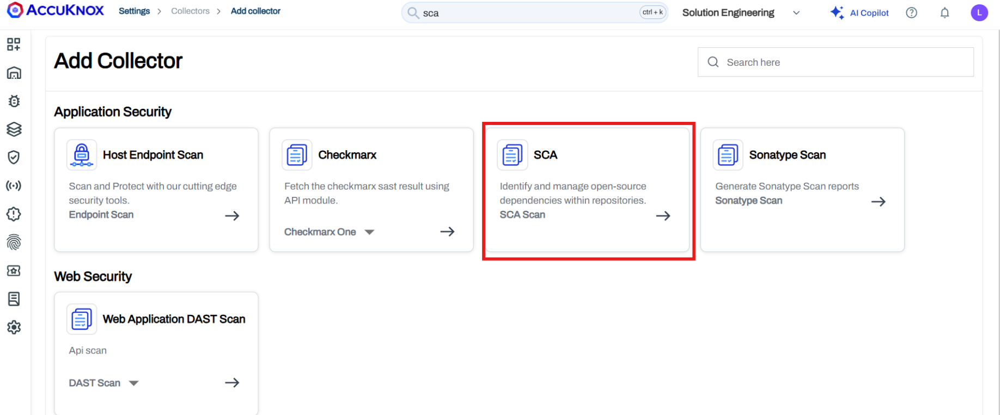
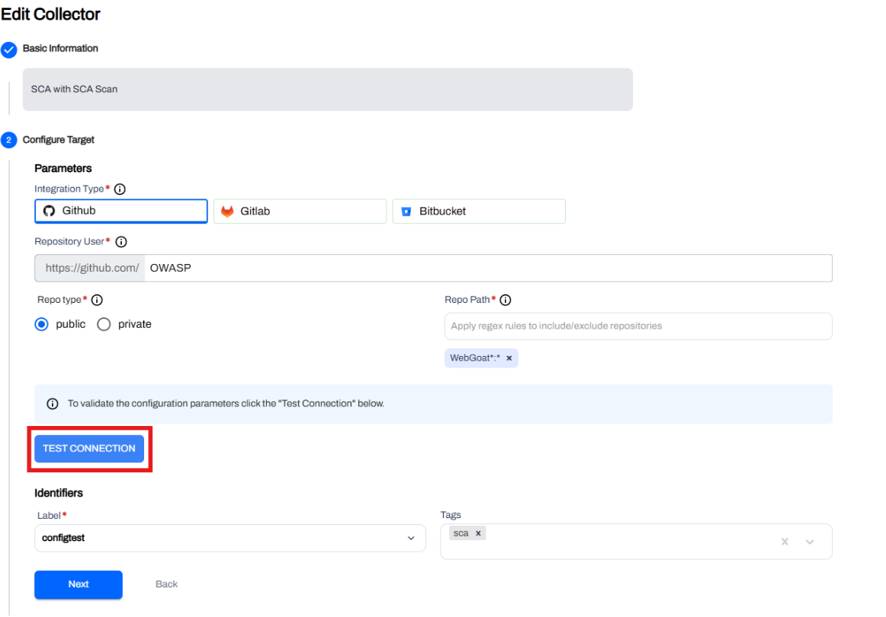
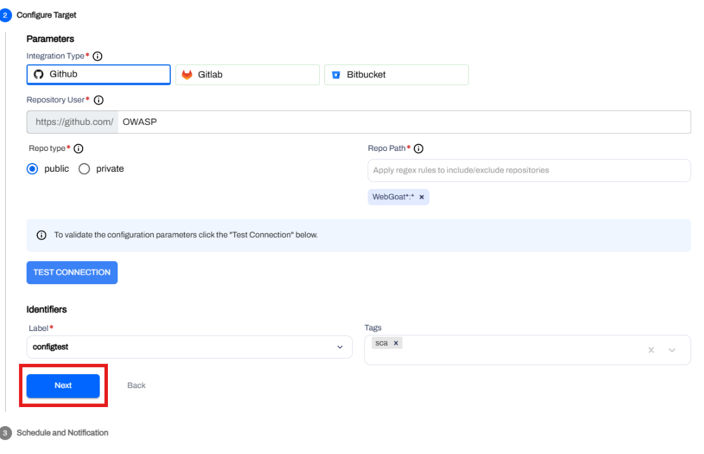
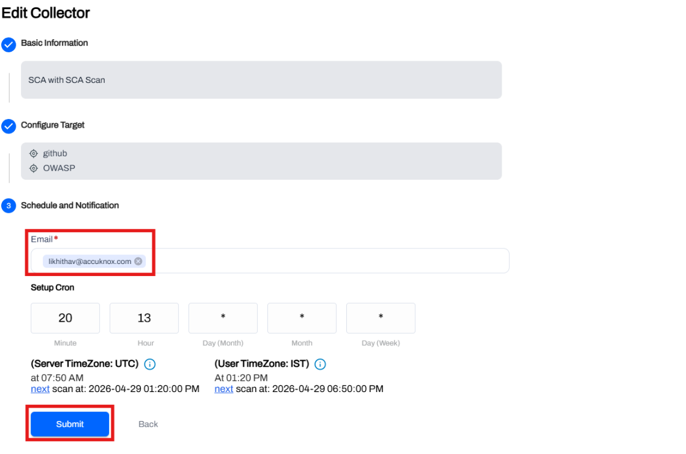
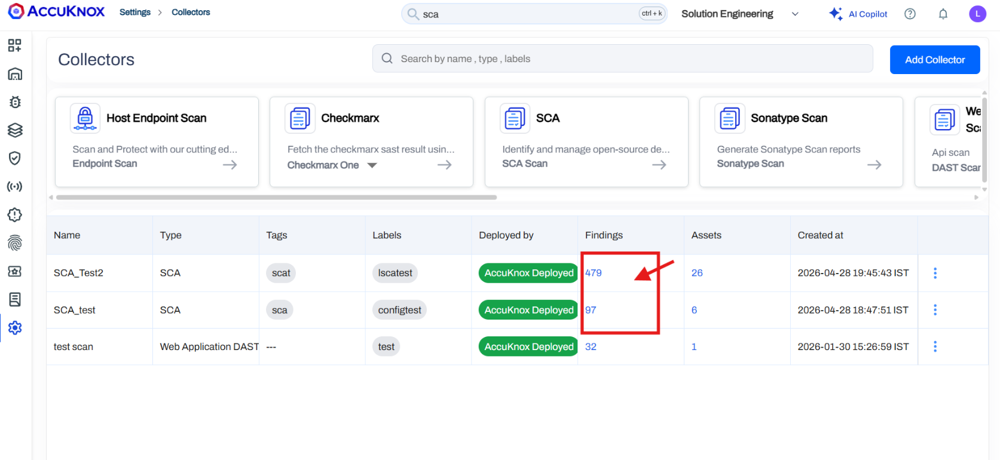
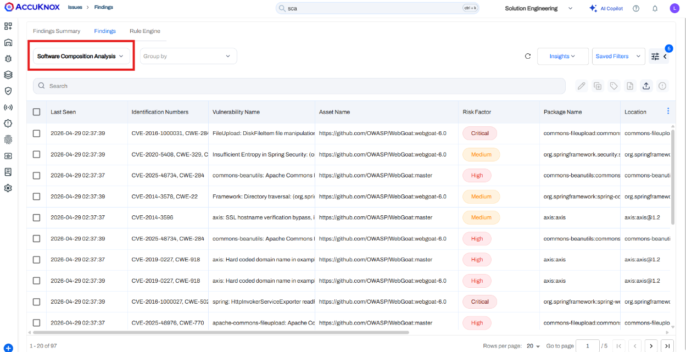

# SCA Scan Using Collectors

AccuKnox Software Composition Analysis (SCA) enables you to scan application dependencies and identify **known vulnerabilities (CVEs)** in open-source libraries. By integrating with source code repositories like GitHub, GitLab and BitBucket, AccuKnox analyzes dependency files present in the repositories to provide visibility into security risks and outdated components.

---

## Configuration Steps

**Step 1:** Log in to the AccuKnox Platform.

**Step 2:** Navigate to **Settings** > **Collectors**.

**Step 3:** Click **Add Collector**.

**Step 4:** Click **SCA**.

**Step 5:** Add the collector name and description(optional) and proceed to configure the following fields:

### Integration Type

**Integration Type** — Select **GitHub** or **GitLab** or **BitBucket**.

### Repository User

**Repository User** — Enter the GitHub/GitLab/BitBucket username or repository owner.

Example: `OWASP`

### Repo Type

**Repo Type** — Select **Public** or **Private** based on repository access.

### Repo Path (Regex)

**Repo Path** — Define the repository and branch scope using regex and click enter.

Examples:
- `^WebGoat$: *` → Scan only WebGoat repo  
- `WebGoat*: *` → Scan all matching repos and branches  

## Connection Validation

**Step 6:** Click **Test Connection** to verify access to the repository.

### Label & Tags

**Label** — Assign a label for organizing the scan.  
Refer: [Create Labels](https://help.accuknox.com/how-to/how-to-create-labels/)

**Tags** *(Optional)* — Add any relevant tags.

Here is an example of how it looks after you have added everything:

## Scheduling & Notifications

**Step 7:** Configure scan scheduling using cron expressions.

**Step 8:** Enter email address to receive scan notifications and press **Enter**.

## Scan Execution

**Step 9:** Submit the collector. The scan will run based on the configured schedule.

**Step 10:** Once the **Findings** column is populated, click on it to be redirected to the SCA findings page with all necessary details.

