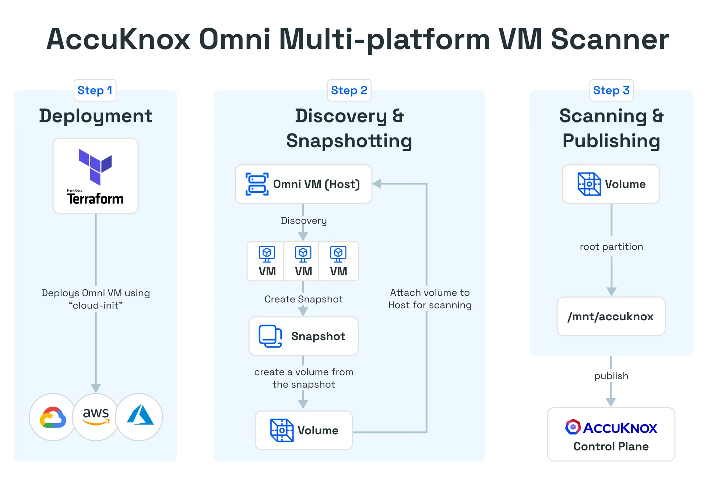
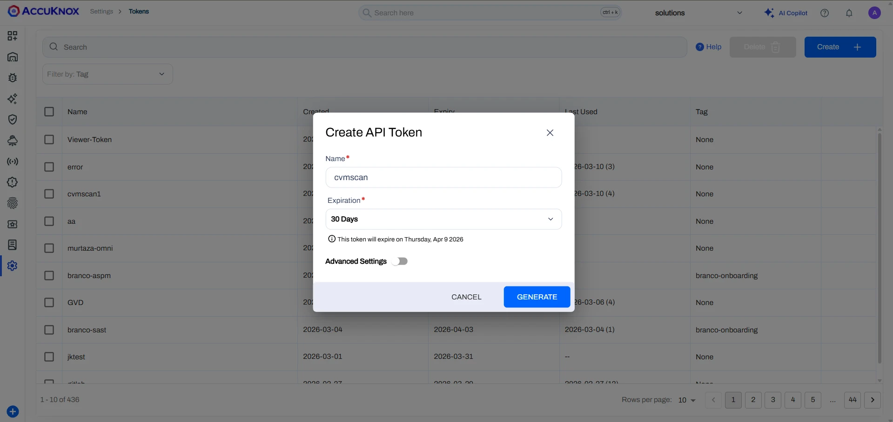
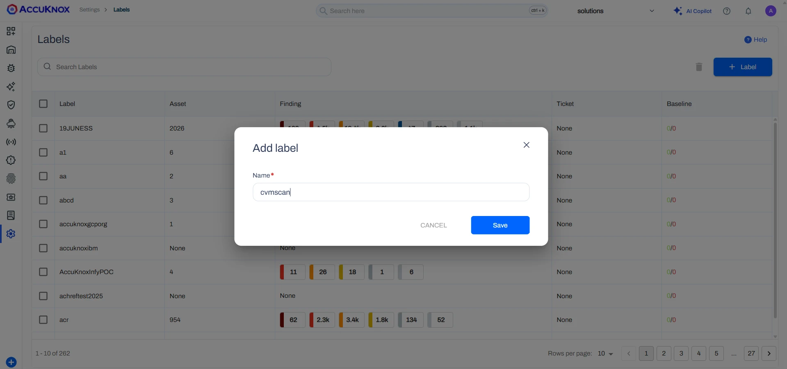
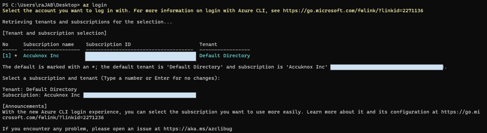
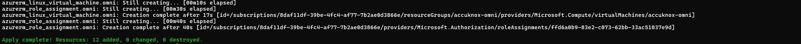
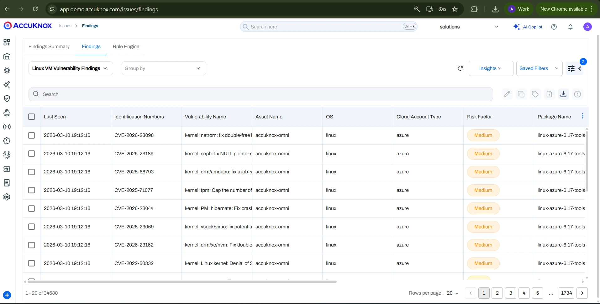
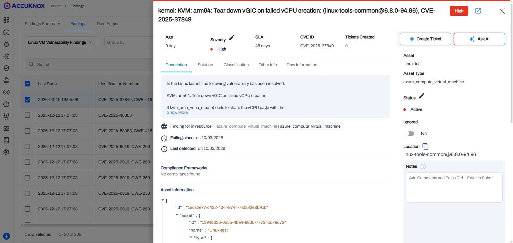

# Agentless Azure VM Scanning

Azure Virtual Machines (VMs) are on-demand, scalable, secure computing resources in the Microsoft Azure cloud that provide full control over the operating system (Windows or Linux) without managing physical hardware.

Protecting these VMs from threats such as misconfigurations, vulnerabilities, and malware is essential. AccuKnox Omni offers multi-platform VM scanning with agentless detection of vulnerabilities and malware to help secure cloud VMs.



## Requirements

- Terraform Script (AccuKnox team will provide)
- AccuKnox Platform access
- Artifact Label, API Token, Tenant ID, and AccuKnox Endpoint from the portal (see steps below)
- Azure Account Access with Owner Permission
- Terraform installed (version `~> 1.12`)

## Steps to Scan the VM

### Step 1: Create Artifact Token

Navigate to **Settings > Tokens > Create** to generate your token.



### Step 2: Create Artifact Label

Navigate to **Settings > Labels > + Label** to create a new label.



### Step 3: Configure the Terraform Variables

Locate the script variables file at `terraform/azure/terraform.tfvars.example`. Change the variables in the file according to your environment:

```hcl
subscription_id    = "*****************************"
location           = "UAE North"
enable_public_ip   = true
public_key_path    = "C:/Users/raJAB/.ssh/id_ed25519.pub"
artifact_token     = "<paste here the token that you have created>"
artifact_endpoint  = "https://cspm.demo.accuknox.com/api/v1/artifact/"
artifact_label     = "cvmscan1"
artifact_tenant_id = 111
omni_additional_flags = {
  "local-publisher"     = "false"
  "skip-malware-scan"   = "false"
  "log-level"           = "info"
  "log-format"          = "text"
  "trigger-immediately" = "true"
  "crontab"             = "@daily"
  # "vm-name-regex"       = "^target-vm$"
  # "vm-label-regex"      = "foo=bar"
  # "vm-label-regex"      = "bar=bazz"
}
```

### Step 4: Configure the Azure CLI

Configure the Azure CLI using your credentials, or use the Azure Cloud Shell.



### Step 5: Prepare Terraform Files

Go to the directory where the Terraform files (shared by AccuKnox) are located:

```bash
cd azure
cp terraform.tfvars.example terraform.tfvars
```

### Step 6: Run Terraform Commands

Initialize the Terraform working directory by downloading required providers and modules:
```bash
terraform init
```

Generate an execution plan showing what changes Terraform will make to the infrastructure:
```bash
terraform plan
```

Apply the planned changes to create, update, or delete infrastructure resources:
```bash
terraform apply
```



Once `terraform apply` is completed, it will take 15-20 minutes to scan your VMs hosted on Azure Cloud.

## View Findings

Navigate to **AccuKnox Portal > Issues > Findings > Findings Tab > Select "Windows/Linux VM Vulnerability Findings"** to view the results.



Click on any finding to view detailed information.



## Troubleshooting

SSH into the VM provisioned by the Terraform script named `AccuKnox-Omni`.

Check if the dependencies deployed successfully using the following command:
```bash
tail -f /var/log/cloud-init-output.log
```

Check the scanner logs using:
```bash
journalctl -u omni -f
```

In case you see any errors, please contact your AccuKnox point of contact or email `support@accuknox.com` with the logs from the commands above.
