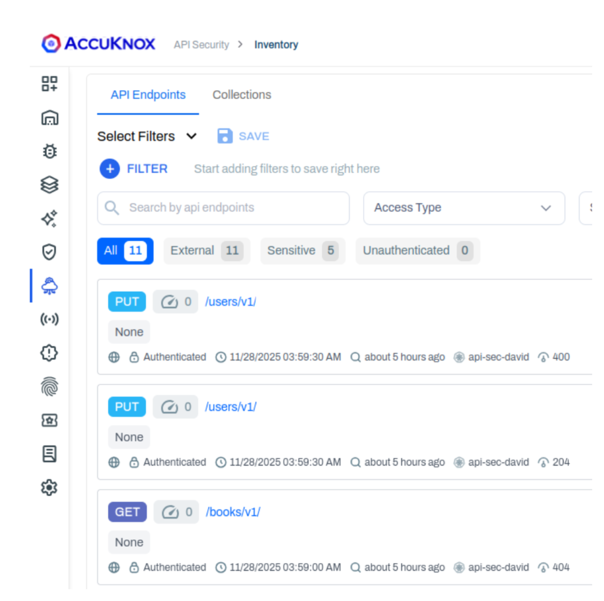

# Traffic Connector for Istio

This guide details the integration of Istio with the AccuKnox API Security Module.

!!! info
    The AccuKnox API Security Module supports two integration methods with Istio:

    1.  **Istio Service Mesh**: Monitors service-to-service communication within the mesh using sidecar proxies.
    2.  **Istio Gateway**: Monitors ingress and egress traffic through the Istio Gateway.

    **Follow the steps below to setup Istio as well as a sample application. If you already have an application running, you can skip straight to [Install AccuKnox API Security Module](#install-accuknox-api-security-module)**.

??? example "Install Google Microservices Demo (Optional)"
    This demo application is useful for generating realistic service-to-service traffic.

    **1. Create Namespace**

    ```bash
    kubectl create namespace microservices-demo
    ```

    **2. Deploy the Demo**

    ```bash
    kubectl apply -n microservices-demo \
      -f https://raw.githubusercontent.com/GoogleCloudPlatform/microservices-demo/main/release/kubernetes-manifests.yaml
    ```

    **3. Verify Deployment**

    ```bash
    kubectl get pods -n microservices-demo
    ```

    Wait until all pods are in the `Running` state.

---

## Install Istio

Istio provides **sidecar injection** and **gateway support**.

### 1. Download Istio

```bash
curl -L https://istio.io/downloadIstio | sh -
cd istio-*
export PATH=$PWD/bin:$PATH
```

### 2. Install Istio Control Plane

Install using the **default profile** (recommended for most setups):

```bash
istioctl install --set profile=demo -y
```

Verify the installation:

```bash
kubectl get pods -n istio-system
```

## 2. Setup Istio Gateway (For Gateway-based Integration)

If you are using an Istio Gateway-based integration, set up the Istio Gateway and a Virtual Service to route traffic.

**Create Gateway configuration:**

```bash
cat <<'EOF' > gateway.yaml
apiVersion: networking.istio.io/v1beta1
kind: Gateway
metadata:
  name: demo-gateway
  namespace: microservices-demo
spec:
  selector:
    istio: ingressgateway
  servers:
  - port:
      number: 80
      name: http
      protocol: HTTP
    hosts:
    - "*"
EOF
```

Apply the configuration:

```bash
kubectl apply -f gateway.yaml
```

**Create a `VirtualService` to route traffic:**

```bash
cat <<'EOF' > virtualservice.yaml
apiVersion: networking.istio.io/v1beta1
kind: VirtualService
metadata:
  name: frontend
  namespace: microservices-demo
spec:
  hosts:
  - "*"
  gateways:
  - demo-gateway
  http:
  - route:
    - destination:
        host: frontend
        port:
          number: 80
EOF
```

Apply the configuration:

```bash
kubectl apply -f virtualservice.yaml
```

---

## 3. Integrate using Istio Service Mesh

For a service mesh-based integration, execute the following steps.

#### 1. Enable Istio Sidecar Injection

Enable automatic sidecar injection for workloads.

```bash
kubectl label namespace microservices-demo istio-injection=enabled
```

!!! note
    Replace `microservices-demo` with the namespace that you wish to monitor.

#### 2. Restart Pods

```bash
kubectl rollout restart deployment -n microservices-demo
```

**Verify sidecars:**

```bash
kubectl get pods -n microservices-demo
```

Each pod should now have **2 containers**.

---

## Install AccuKnox API Security Module

```bash
helm upgrade --install sentryflow \
  oci://public.ecr.aws/k9v9d5v2/sentryflow-helm-charts \
  --version v0.1.6 \
  --namespace sentryflow \
  --create-namespace \
  --set config.receivers.istio.enabled=true \
  --set config.receivers.namespace=istio-system
```

### Verify successful installation

1.  **Check WasmPlugins:**

    Ensure `http-filter-gateway` and `http-filter-sidecar` are present.

    ```bash
    kubectl get wasmplugins.extensions.istio.io -n istio-system
    ```

2.  **Check EnvoyFilter:**

    ```bash
    kubectl get envoyfilters.networking.istio.io -n istio-system
    ```

3.  **Check plugins are pulled in `istio-ingressgateway`:**

    ```bash
    kubectl -n istio-system logs deploy/istio-ingressgateway -c istio-proxy | \
    grep -i -E "wasm|oci|pull|download|http-filter-gateway|http-filter-sidecar"
    ```

    You should see logs indicating the image fetch:

    ```text
    info wasm fetching image k9v9d5v2/sentryflow-httpfilter from registry public.ecr.aws with tag latest-sidecar
    info wasm fetching image k9v9d5v2/sentryflow-httpfilter from registry public.ecr.aws with tag latest-gateway
    ```

## Patch Summary Engine

!!! warning "Important"
    Before this step, you must onboard the cluster on SaaS if you haven't already.

### Configure Discovery Engine

Edit the ConfigMap:

```bash
kubectl edit cm -n agents discovery-engine-sumengine
```

Update the configuration to enable SentryFlow:

```yaml
data:
  app.yaml: |
    ...
    summary-engine:
      sentryflow:
        enabled: true
        cron-interval: 0h0m30s
        decode-jwt: true
        include-bodies: true
        redact-sensitive-data: false
        threshold: 10000
        sensitive-rules-files-path:
          - /var/lib/sumengine/sensitive-data-rules.yaml
    watcher:
      ...
      sentryflow:
        enabled: true
        event-type:
          access-log: true
          metric: false
        service:
          enabled: true
          name: sentryflow
          port: "8080"
          url: "sentryflow.sentryflow"
```

**Restart Discovery Engine:**

```bash
kubectl rollout restart deployment -n agents discovery-engine
```

**Check AccuKnox API Security Module logs:**

Look for `exporter added` in the logs.

```bash
kubectl logs -n sentryflow -l app=sentryflow -f
```

!!! info
    This can take a little time as the discovery engine starts and terminates a couple of times. The logs should eventually show up in SaaS.

---

??? example "Test Ingress Gateway with Microservice Demo (Optional)"
    | Step | Action | Command |
    | :--- | :--- | :--- |
    | 1 | **Port forward gateway** | `kubectl port-forward -n istio-system svc/istio-ingressgateway 8080:80` |
    | 2 | **Open in browser** | [http://localhost:8080](http://localhost:8080) |
    | 3 | **Make requests (CLI)** | `curl http://localhost:8080/test`<br>`curl http://localhost:8080/sentryflow`<br>`curl http://localhost:8080/echo` |
    | 4 | **Verify Logs** | `kubectl logs -n agents discovery-engine-<your pod> -f`<br>Look for: `sent N events` |

## Check the API Inventory Page

Check AccuKnox's API inventory by setting the time filter to **1hr** or **15 minutes**.
It can take from 30s to 1 min to get logs in SaaS.
Check the metadata in the API for **Gateway** and **Sidecar** source.




!!! tip "Next Steps"
    Proceed to the [**API Security Use Case**](../use-cases/api-security.md) to learn how to view your API inventory, create collections, upload OpenAPI specifications, and scan for security findings.