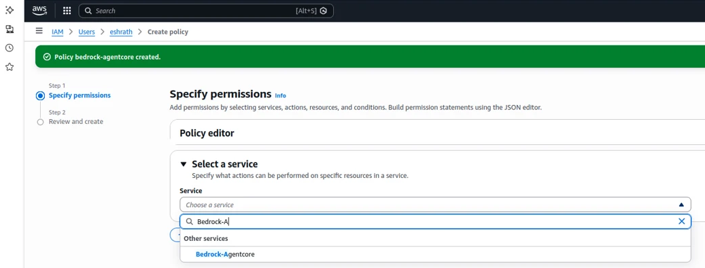
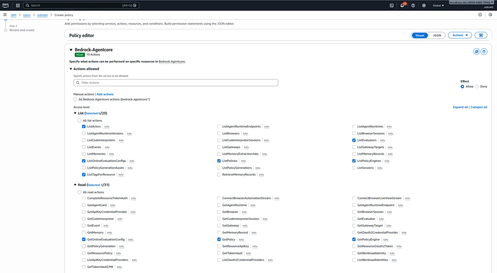

# Integrate Bedrock-Agentcore with AccuKnox for AI Asset Scanning

## Permissions for AI Asset Scanning (AWS)

### General Scan Permission (Required)

* Create an **IAM User** and attach the following managed policies:
    * `ReadOnly` (AWS managed -- job function)
    * `SecurityAudit` (AWS managed -- job function)

### Permissions for Bedrock & SageMaker

* Create an **inline policy** with the following permissions:
    * **AWS Bedrock:**
        * `bedrock:InvokeModel`
        * `bedrock:ListImportedModels`
        * `bedrock:ListModelInvocationJobs`
    * **AWS SageMaker:**
        * `sagemaker:InvokeEndpoint`
    * **Bedrock-AgentCore:**

        ```json
        [
            "bedrock-agentcore:GetEvaluator",
            "bedrock-agentcore:InvokeAgentRuntime",
            "bedrock-agentcore:ListPolicies",
            "bedrock-agentcore:ListOnlineEvaluationConfigs",
            "bedrock-agentcore:ListPolicyEngines",
            "bedrock-agentcore:GetPolicyEngine",
            "bedrock-agentcore:ListTagsForResource",
            "bedrock-agentcore:ListActors",
            "bedrock-agentcore:GetOnlineEvaluationConfig",
            "bedrock-agentcore:ListEvaluators",
            "bedrock-agentcore:GetPolicy"
        ]
        ```

### Steps to Configure IAM User for AI Asset Scanning (AWS)

1. Navigate to **IAM > Users > Create User**.
2. Select the AWS managed policies **ReadOnlyAccess** and **SecurityAudit** to attach to the user.
3. Go to **Add Permissions > Create inline policy**.
    * **For AgentCore permissions**, add an additional inline policy by selecting the service **Bedrock-Agentcore**.
    * Allow the required read and runtime actions (including `InvokeAgentRuntime`, `GetEvaluator`, `GetPolicy`, `GetPolicyEngine`, `GetOnlineEvaluationConfig`, and the corresponding `List*` actions such as `ListPolicies`, `ListPolicyEngines`, `ListEvaluators`, `ListOnlineEvaluationConfigs`, `ListActors`, and `ListTagsForResource`).
    * Set **Resources** to **All**.

        

        

        

4. For **SageMaker Permissions**, add another set of permissions by selecting the service **SageMaker**, allowing the action **InvokeEndpoint**, and choosing **All** under resources.
5. For **Bedrock Permissions**, select the service **Bedrock**, allow the actions **InvokeModel**, **ListImportedModels**, and **ListModelInvocationJobs**, and choose **All** under resources.
6. Finally, review and create the policy to attach it to the IAM user.

### Onboarding

1. To onboard Cloud Account Navigate to **Settings > Cloud Accounts**.
2. In the Cloud Account Page select **Add Account** option.
3. Select the **AWS** option.
4. In the next Screen select the labels and Tags field from the dropdown Menu.
5. After giving labels and Tag in the Next Screen Provide the AWS account's **Access Key** and **Secret Access Key ID** and Select the **Region** of the AWS account.
6. AWS account is added to the AccuKnox using Access Key Method. We can see the onboarded cloud account by navigating to **Settings > Cloud Accounts** option.
