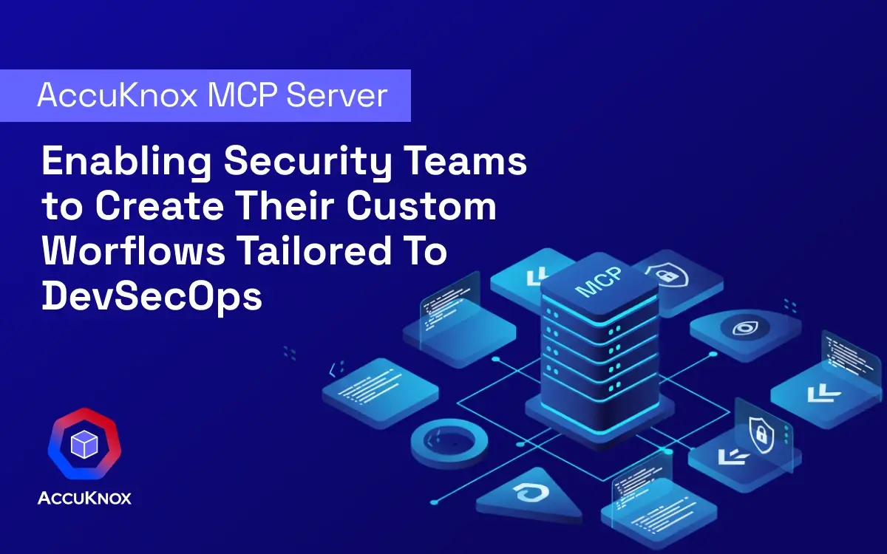
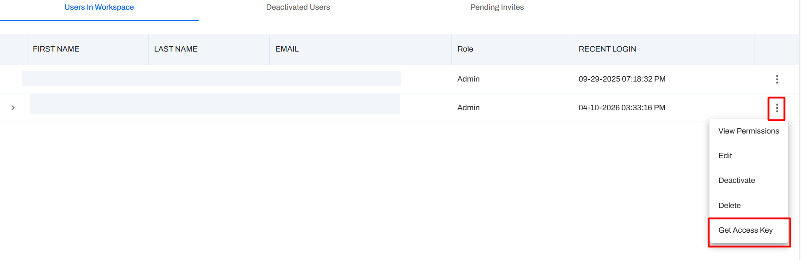
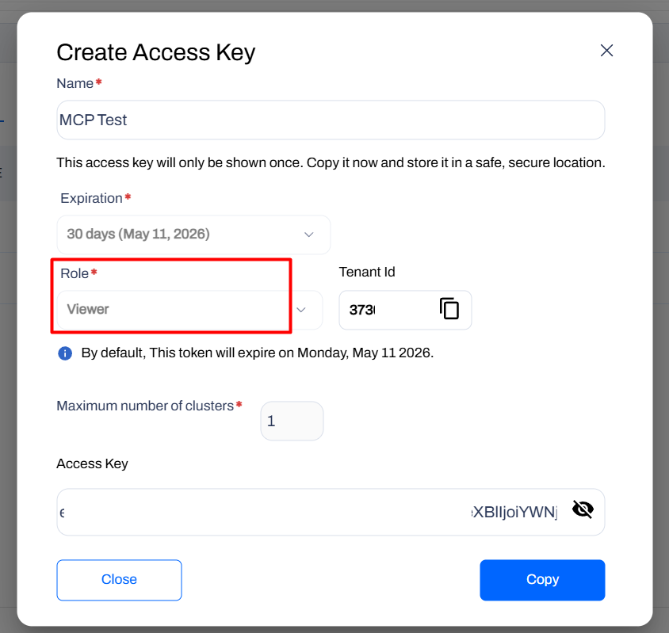
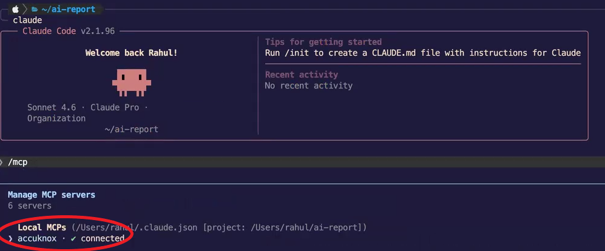
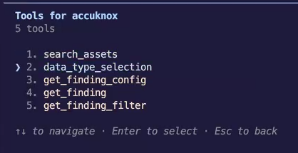
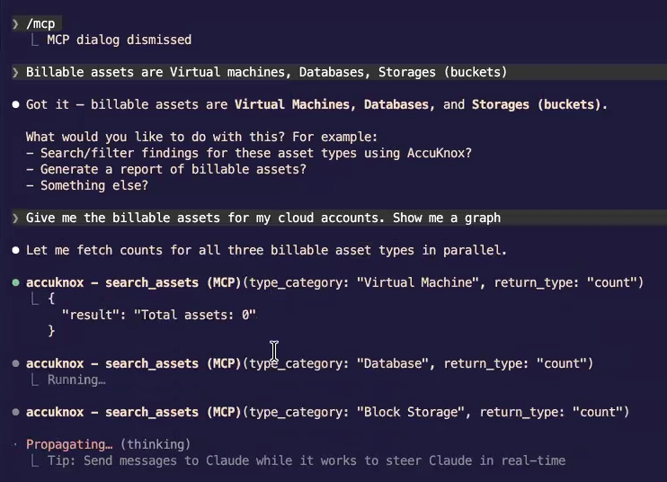
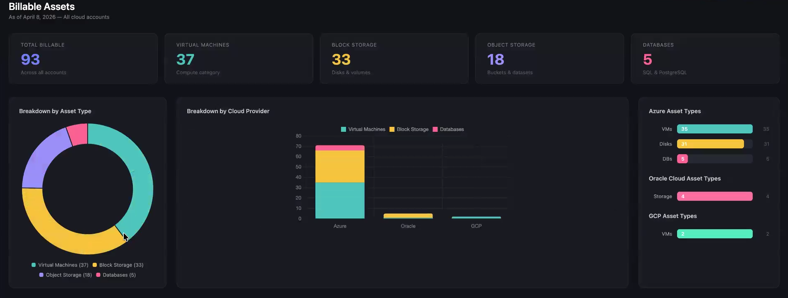
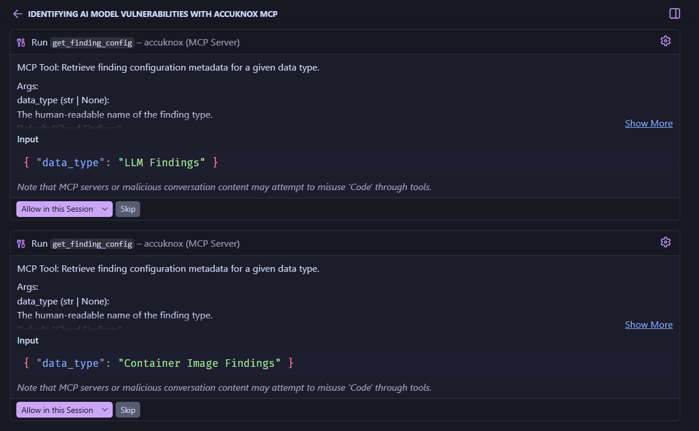
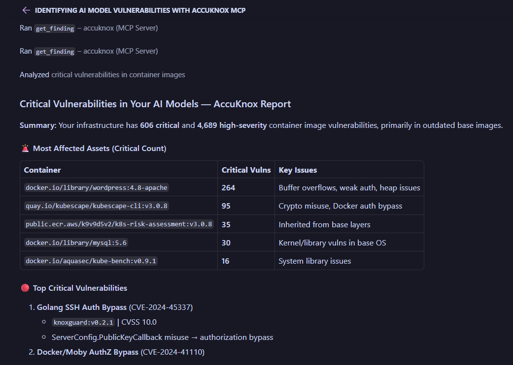
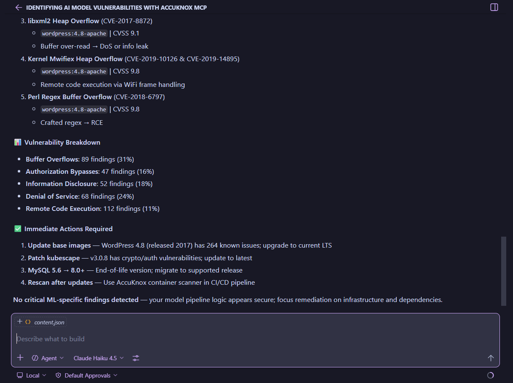

# MCP Server for AccuKnox



Query your cloud security data directly from AI tools (VS Code Copilot, Cursor, Claude Code, Gemini CLI) instead of logging into the dashboard. Get live answers about assets, findings, and compliance.

Hosted at **`mcp-server.accuknox.com/mcp`**. Read-only, no installation needed, token-authenticated. Each token is scoped to one tenant.

!!! tip "Use cases"
    * Ask: *"How many critical vulnerabilities?"* or *"Show me all public S3 buckets."*
    * Generate custom reports (CIS, STIG compliance, etc.)
    * Build dashboards and visualizations in your AI terminal

> :fontawesome-brands-github: **Source & self-hosting:** [github.com/accuknox/mcp_server](https://github.com/accuknox/mcp_server)

---

## Step 1: Get Your API Token

1. Log in and go to **[Settings → User Profiles](https://app.demo.accuknox.com/settings/user-profiles)** > click the **⋮ menu** > **Get Access Key**.

      

2. Fill in the dialog:
    - **Name**: e.g., `MCP Access`
    - **Role**: `Viewer` (read-only)
    - **Expiration**: Choose a date
    - **Tenant Id**: Save this value

    

3. **Copy** the key and save it somewhere safe (only shown once).

!!! warning
    Tokens are scoped to one tenant. For multiple tenants, generate separate tokens and use separate project folders.

---

## Step 2: Connect Your AI Tool

Your endpoint and headers:

| Header | Value |
|---|---|
| `base_url` | Your AccuKnox environment URL, e.g. `https://cspm.demo.accuknox.com/` |
| `token` | The API token you copied in Step 1 |

Select your AI tool below:

=== "VS Code (GitHub Copilot)"

    Have [GitHub Copilot](https://marketplace.visualstudio.com/items?itemName=GitHub.copilot) installed.

    Create `.vscode/mcp.json`:

        ```
        {
          "servers": {
            "accuknox": {
              "type": "http",
              "url": "https://mcp-server.accuknox.com/mcp",
              "headers": {
                "base_url": "https://cspm.demo.accuknox.com/",
                "token": "your_token_here"
              }
            }
          }
        }
        ```

    Save the file. VS Code will show a **Start** button. Open Copilot Chat (`Ctrl+Shift+I` / `Cmd+Shift+I`) and confirm **accuknox** in the Tools list.

=== "Cursor"

    Create `.cursor/mcp.json`:

        ```
        {
          "mcpServers": {
            "accuknox": {
              "type": "http",
              "url": "https://mcp-server.accuknox.com/mcp",
              "headers": {
                "base_url": "https://cspm.demo.accuknox.com/",
                "token": "your_token_here"
              }
            }
          }
        }
        ```

    Restart Cursor and check the MCP panel for the connected `accuknox` server.

=== "Claude Code"

    In your project folder, create `.claude.json`:

        ```
        {
          "mcpServers": {
            "accuknox": {
              "type": "http",
              "url": "https://mcp-server.accuknox.com/mcp",
              "headers": {
                "base_url": "https://cspm.demo.accuknox.com/",
                "token": "your_token_here"
              }
            }
          }
        }
        ```

    Open the folder in Claude Code (`claude` in terminal), then run `/mcp` to verify **connected**.

      

=== "Claude Desktop"

    Edit your Claude Desktop config file:
        - **macOS:** `~/Library/Application Support/Claude/claude_desktop_config.json`
        - **Windows:** `%APPDATA%\Claude\claude_desktop_config.json`

    Add the AccuKnox entry:

        ```
        {
          "mcpServers": {
            "accuknox": {
              "url": "https://mcp-server.accuknox.com/mcp",
              "headers": {
                "base_url": "https://cspm.demo.accuknox.com/",
                "token": "your_token_here"
              }
            }
          }
        }
        ```

    Save and restart Claude Desktop. Look for the 🔌 icon to confirm connection.

=== "Gemini CLI"

    Add the MCP server:

        ```bash
        gemini mcp add accuknox --url https://mcp-server.accuknox.com/mcp \
          --header "base_url=https://cspm.demo.accuknox.com/" \
          --header "token=your_token_here"
        ```

    !!! note
        If your Gemini CLI version does not support `--header` flags, use a local wrapper instead. See the [self-hosting section](#self-hosting-optional) below.

---

## Available Tools

Once connected, your AI tool will have access to **5 tools**:



| Tool | What it does |
|---|---|
| `search_assets` | Search, count, and filter cloud assets by type, region, cloud provider, status, and date. |
| `data_type_selection` | List all available finding types (Cloud, Container, CIS Benchmark, DAST, SAST, SCA, STIG, LLM, etc.). |
| `get_finding_config` | Get valid filters, display fields, grouping, and sort options for a finding type. |
| `get_finding` | Fetch findings with full filter, display, grouping, and pagination control. |
| `get_finding_filter` | Get available filter values for a specific field within a finding type. |

!!! info
    All JSON fields from AccuKnox GET APIs are queryable: assets, findings, compliance and benchmark results across all platforms.

!!! note
    KubeArmor real-time alerts (MongoDB) not yet available.

---

## Sample Use Case: Billable Assets Report

Generate a billable asset breakdown with dashboard visualization.

### 1. Set up and query

Open your AI tool, run `/mcp`, confirm **accuknox** is connected.


Tell the AI your billable asset definition:
```
Billable assets are Virtual machines, Databases, Storages (buckets)
```

Then ask:
```
Give me the billable assets for my cloud accounts. Show me a graph.
```

The server calls `search_assets` in parallel and returns live counts:



### 2. Review results

The AI returns a summary:

| Type | Count | Cloud |
|---|---|---|
| Virtual Machines | 37 | Azure (35), GCP (2) |
| Block Storage | 33 | Azure (31), Oracle (4) |
| Object Storage | 18 | — |
| Databases | 5 | Azure (5) |
| **Total** | **93** | |

Plus a dashboard:



The dashboard includes:

- **Donut chart**: Asset type breakdown with percentages
- **Stacked bar chart**: Breakdown by cloud provider (Azure, Oracle, GCP)
- **Per-provider detail**: Horizontal bar charts for each provider

!!! tip
    Live API calls = deterministic results. No guessing. Be specific: "S3 buckets" not just "storage".

---

## Sample Use Case: AI Model Vulnerability Report

Identify critical vulnerabilities across container images, LLM deployments, and dependencies.

### 1. Ask and get results

```
What are the critical vulnerabilities in my AI models?
```

The server auto-identifies relevant finding types, calls `get_finding_config` for **LLM Findings** and **Container Image Findings**, then runs `get_finding` and cross-references results.



### 2. Review the report



### 3. Get action items



Here the AI identifies 368 critical vulnerabilities across LLM deployments and container images, with the top categories being Buffer Overflows and Denial of Service. It then recommends specific remediation steps like updating base images, patching vulnerable tools, migrating outdated software, and rescanning after fixes.

You can ask follow-up questions like:
```
Show me the top 5 most vulnerable container images and their CVEs.
```

Using natural language to drill down into the data is a game-changer for security teams, making it easy to prioritize and act on critical issues without sifting through dashboards or raw API responses.

!!! tip
    The `get_finding_config` → `get_finding` pattern ensures accurate, structured results every time.

---

## More Example Prompts

!!! success "Try these in your AI tool"
    * "How many cloud assets do I have?"
    * "Show me all AWS S3 buckets in us-east-1."
    * "What are the critical vulnerabilities in my AI models?"
    * "List deployed AI models discovered in the last 24 hours."
    * "How many of my assets are publicly exposed?"
    * "Show me Cloud Findings with Critical severity, grouped by resource type."
    * "Generate a CIS Kubernetes benchmark compliance report."
    * "Find all secret scan findings from the last 7 days."
    * "What SAST findings exist for my repositories?"

---

## Troubleshooting

!!! bug
    * **Not connecting?** Check `base_url` and `token` in `mcp.json`.
    * **Auth failed?** Token expired? Generate a new one from [Settings → User Profiles](https://app.demo.accuknox.com/settings/user-profiles).
    * **Wrong tenant data?** Verify `base_url` matches your environment.
    * **Tool missing?** Restart your AI tool. In VS Code, use the **Start** button.

## Self-Hosting (Optional)

Clone and run the server locally for private environments.

??? example "Self-hosting instructions"

    **Requirements:** Python 3.10+, AccuKnox API token.

    ```bash
    git clone https://github.com/accuknox/mcp_server/
    cd mcp_server
    python3 -m venv venv
    source venv/bin/activate  # Windows: venv\Scripts\activate
    pip install -r requirements.txt
    ```

    Create a `.env` file in the project root:

    ```env
    ACCUKNOX_BASE_URL=https://cspm.demo.accuknox.com
    ACCUKNOX_API_TOKEN=your_token_here
    ```

    Then configure your AI tool to point to the local server. In `.vscode/mcp.json`:

    ```json
    {
      "mcpServers": {
        "accuknox": {
          "command": "/absolute/path/to/mcp_server/venv/bin/python",
          "args": ["/absolute/path/to/mcp_server/MCP_server.py"]
        }
      }
    }
    ```

    Or to run the HTTP server locally:

    ```bash
    python3 fastmcp_server.py
    # Server starts on http://0.0.0.0:8000
    ```

    Then point your client at `http://localhost:8000/mcp` using `"type": "http"` in your `mcp.json`.

    For full self-hosting documentation, see the [README on GitHub](https://github.com/accuknox/mcp_server).

---

