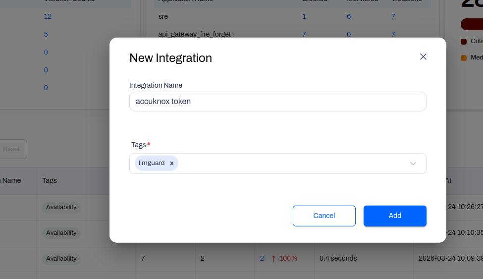
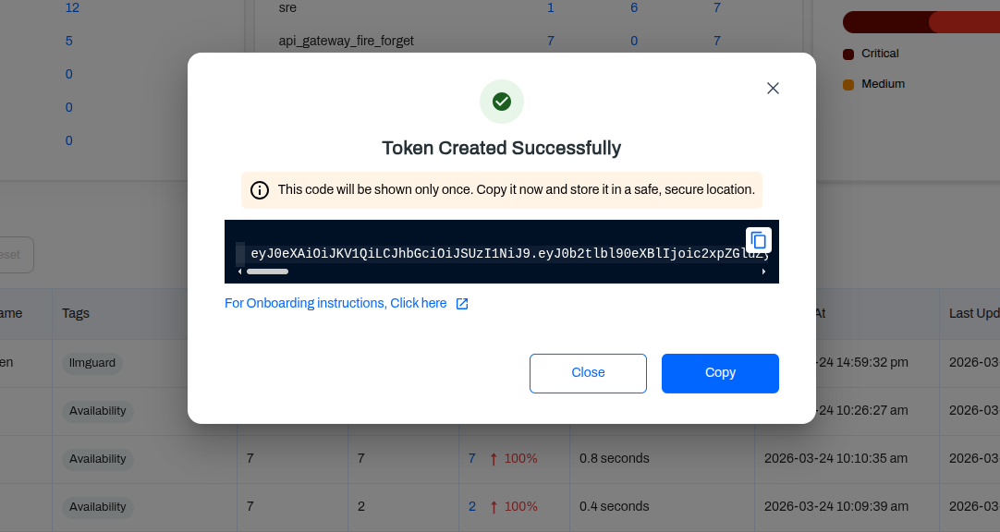
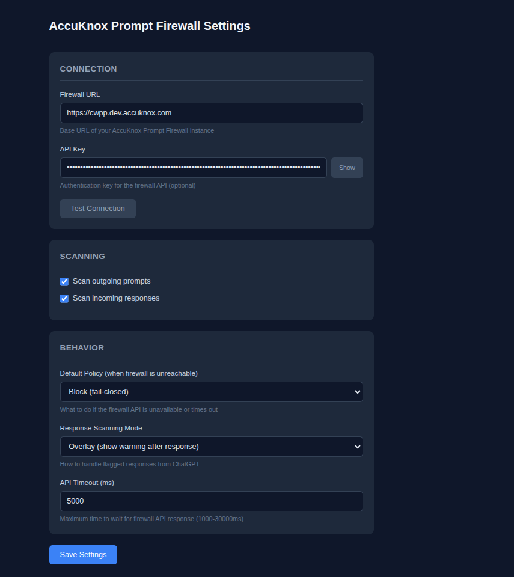
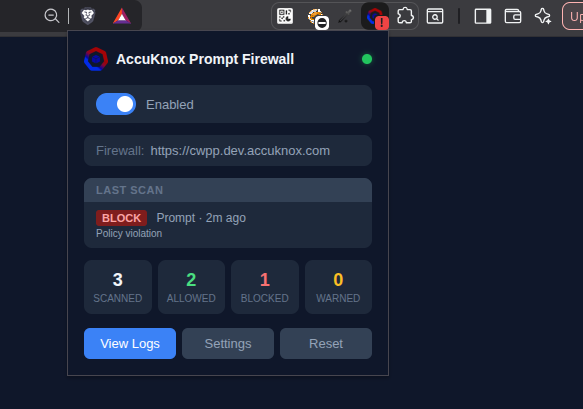
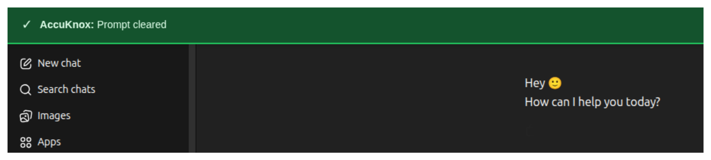
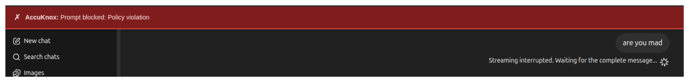
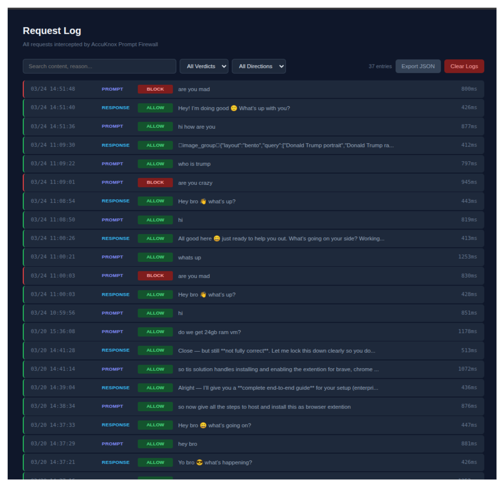

# OpenAI Browser Integration for AccuKnox Prompt Firewall

**Path:** Integrations > AI Security > Prompt Firewall > OpenAI Integration

The AccuKnox Prompt Firewall browser plugin intercepts prompts and responses directly in ChatGPT before they leave your browser session. Blocked prompts show a red banner. Allowed ones pass through silently.

---

## Prerequisites

- An active AccuKnox account with AI Security enabled
- Access to the Integrations section (to generate a token)
- A Chromium-based browser (Chrome, Brave, Edge)

---

## Step 1 — Create a new integration

Go to **AI Security > Integrations** and click **New Integration**.

Fill in the following:

| Field | Value |
|---|---|
| Integration Name | Any descriptive name (e.g. `openai-browser-prod`) |
| Tags | Add relevant tags (e.g. `llmguard`) |

Click **Add** to save.



---

## Step 2 — Copy your token

After saving, the token is displayed once in a confirmation modal.

> **Copy it immediately.** This token will not be shown again after you close the modal. Store it in a secure location (e.g. a password manager).



---

## Step 3 — Download and install the browser plugin

Download the `.crx` extension file and install it in your browser.

**Download link:**
```
https://promptfirewall-plugin-extension.s3.ap-south-1.amazonaws.com/ak-prompt-fw-browser-plugin.crx
```

To install in Chrome:

1. Go to `chrome://extensions`
2. Enable **Developer mode** (top right toggle)
3. Drag and drop the `.crx` file onto the page

---

## Step 4 — Configure the extension

Open the extension settings (click the AccuKnox icon in your browser toolbar > **Settings**).

Fill in the two fields:

| Field | Value |
|---|---|
| Firewall URL | `https://cwpp.<ENV>.accuknox.com` |
| API Key | Paste the token from Step 2 |

**ENV examples:** `dev`, `stage`, `demo`, or your tenant name (e.g. `acme`).

Click **Save Settings** then **Test Connection**.



---

## Step 5 — Verify the connection

Once connected, the extension popup shows a green status dot next to **AccuKnox Prompt Firewall**.

Open ChatGPT and send a test prompt. You will see one of the following:

- **Green banner** — prompt cleared, no policy violation
- **Red banner** — prompt blocked due to a policy violation

The extension popup also shows a running count of scanned, allowed, blocked, and warned prompts. Click **View Logs** to see the full request log.






---

## Request log

All intercepted prompts and responses are visible in the **Request Log** (AI Security > Request Log).

Each entry shows the timestamp, direction (PROMPT or RESPONSE), verdict (ALLOW or BLOCK), content preview, and latency.

You can filter by verdict or direction, search by content or reason, and export the full log as JSON.



