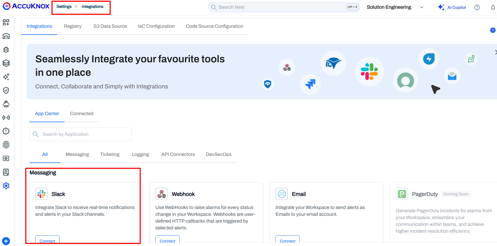
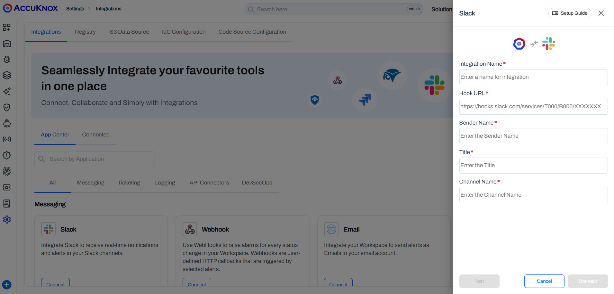

# Slack Integration

Integrate Slack with AccuKnox to receive real-time security alert notifications in your Slack channels.

## Prerequisites

Before you begin, ensure you have:

- A valid, active Slack account
- An **Incoming Webhook URL** for your Slack workspace — follow the [Incoming Webhooks for Slack](https://slack.com/intl/en-in/help/articles/115005265063-Incoming-webhooks-for-Slack) guide to generate one

## Steps to Integrate

1. Navigate to **Settings > Integrations > Slack**.

    

2. Fill in the following fields:

    

    | Field | Description | Example |
    |-------|-------------|---------|
    | **Integration Name** | A display name for this integration | `Container Security Alerts` |
    | **Hook URL** | The Incoming Webhook URL from Slack | `https://hooks.slack.com/services/T000/B000/XXXXXXX` |
    | **Sender Name** | The name that appears as the message sender | `AccuKnox User` |
    | **Channel Name** | The Slack channel to post alerts to | `livealertsforcontainer` |

3. Click **Test** to verify the connection. A test message (`Test message Please ignore !!`) will be posted to the configured channel.

4. Click **Save** to complete the integration. You can now configure alert triggers to send notifications to this Slack channel.

---

[SCHEDULE DEMO](https://www.accuknox.com/contact-us){ .md-button .md-button--primary }
