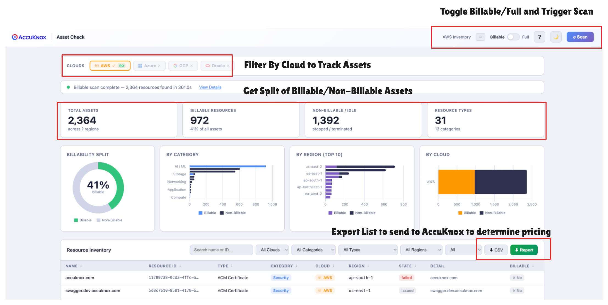
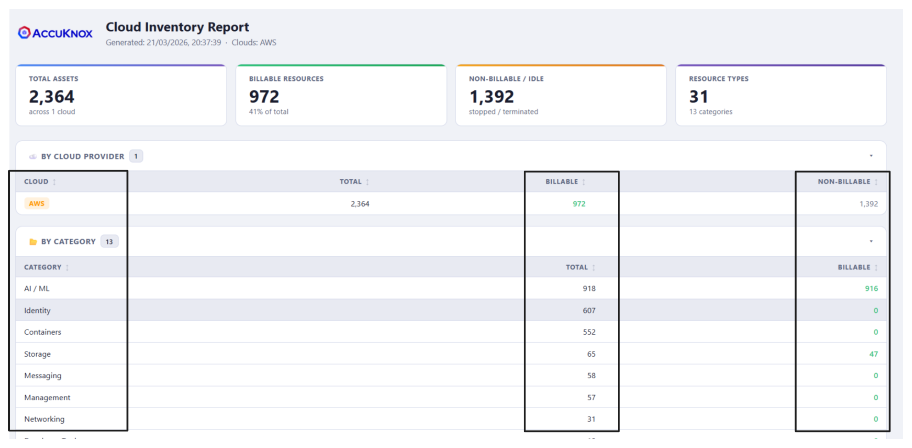

# Get Billable Asset Count (Multi-Cloud)

## Get Total Billable Assets Secured & Priced via AccuKnox

AccuKnox Cloud is priced based on the number of **billable assets** in your cloud account — things like virtual machines, Kubernetes clusters, databases, and serverless functions. Before you onboard, you and the AccuKnox team need to agree on that number.

**AccuKnox Asset Check** gives you that number in under a minute. Run it once, export the report, and share it with the AccuKnox team to get an accurate quote with no surprises.

---

## Use This Tool to Get an Accurate Pricing Quote, Onboard a New Cloud, or Audit Your Inventory

| Getting a pricing quote | Onboarding a new cloud | Periodic spend review | Complete cloud inventory |
|------------------------|------------------------|----------------------|-------------------------|
| Run a **Billable scan**, export the HTML report, and share it with your AccuKnox contact | Run a Billable scan scoped to that cloud and verify the asset list before onboarding | Re-run at any time and compare the billable count over time | Run a **Full scan** to discover every resource type across all regions |

---

## Prerequisites

You need **CLI access to your cloud account** on the machine where you run this tool. No new accounts or API keys are required — the tool reuses your existing cloud CLI credentials.

| Cloud | What you need |
|-------|--------------|
| **AWS** | AWS CLI configured — `aws sts get-caller-identity` must succeed |
| **Azure** | Azure CLI logged in — `az account show` must succeed, or service principal env vars set |
| **GCP** | Application Default Credentials — `gcloud auth application-default login` or `GOOGLE_APPLICATION_CREDENTIALS` set |
| **Oracle OCI** | OCI CLI configured — `~/.oci/config` present (run `oci setup config` if needed) |

Only the clouds you have credentials for will be active in the UI. The rest are grayed out.

### Read-Only Access (Recommended)

The tool never writes to your cloud. For safety, restrict its credentials to read-only:

| Cloud | Command |
|-------|---------|
| **AWS** | `aws iam attach-user-policy --user-name USER --policy-arn arn:aws:iam::aws:policy/ReadOnlyAccess` |
| **Azure** | `az role assignment create --role Reader --assignee PRINCIPAL --scope /subscriptions/SUB_ID` |
| **GCP** | `gcloud projects add-iam-policy-binding PROJECT_ID --member="serviceAccount:SA" --role="roles/viewer"` |
| **Oracle OCI** | Grant only `inspect` and `read` verbs in IAM policies — no `manage` or `use` |

The UI automatically checks your credential permissions and shows a badge on each cloud pill — **green RO** if read-only, **orange !** if write access is detected.



---

## Install

**macOS / Linux**

```bash
curl -fsSL https://raw.githubusercontent.com/accuknox/ak-asset-check/main/install.sh | sh
```

Installs to `/usr/local/bin`. To change the destination: `INSTALL_DIR=~/.local/bin curl -fsSL … | sh`

**Windows (PowerShell)**

```powershell
iwr -useb https://raw.githubusercontent.com/accuknox/ak-asset-check/main/install.ps1 | iex
```

Installs to `%LOCALAPPDATA%\Programs\ak-asset-check` and adds it to your user `PATH`.

---

## How to Use It

### 1. Start the tool

```bash
ak-asset-check
# AccuKnox Asset Check — http://0.0.0.0:8000
```

Open **http://localhost:8000** in your browser. Use `PORT=9090 ak-asset-check` to change the port.

### 2. Select which clouds to scan

The cloud bar auto-detects configured accounts. Click a pill to include or exclude it.

### 3. Choose scan mode

Use the **Billable / Full** toggle in the header:

| Mode | Scans | Speed |
|------|-------|-------|
| **Billable** (default) | Key cost-incurring resources only | ~30 seconds |
| **Full** | Every supported service and resource type | 1–5 minutes |

Use **Billable** for pricing. Use **Full** if you need a complete cloud inventory.

### 4. Click ▶ Scan

Progress streams in real time. A status bar shows the active cloud. Click **View Details** to open the scan progress modal, which shows per-cloud status, a live log of every service scanned, and any errors.

### 5. Review results

When the scan completes, the dashboard shows:

- **Summary cards** — Total assets, Billable count (with %), Non-Billable / Idle, and distinct resource types
- **Charts** — Billability donut, breakdown by category, by region (top 10), and by cloud
- **Resource table** — Every discovered asset with name, ID, type, category, cloud, region, state, detail, and billable flag. Searchable and filterable.


### 6. Export and share

| Export | How | Use it for |
|--------|-----|-----------|
| **⬇ Report** | Click "Report" button in the table toolbar | Share with AccuKnox — self-contained HTML with summary, charts-equivalent tables, and full resource list |
| **⬇ CSV** | Click "CSV" button | Your own spreadsheet analysis |


---

## What to Share with AccuKnox

After running a **Billable scan**, click **⬇ Report** and send the downloaded HTML file to your AccuKnox account contact. It is self-contained and opens in any browser — no login required to view it. The report includes the total billable count per cloud, a breakdown by resource type and category, and the full asset list. That is everything the AccuKnox team needs to generate an accurate pricing proposal.



---

## What Counts as "Billable"?

These are the resource types AccuKnox secures and prices on:

=== "AWS"
    - EC2 Instances
    - RDS Instances
    - Aurora Clusters
    - DynamoDB Tables
    - Lambda Functions
    - EKS Clusters
    - ECS Clusters
    - S3 Buckets
    - Bedrock AI Models

=== "Azure"
    - Virtual Machines (incl. Scale Sets)
    - AKS Clusters
    - Azure Functions
    - SQL Databases / Managed Instances / Elastic Pools
    - Cosmos DB
    - Container Registries
    - MySQL / PostgreSQL / MariaDB Servers
    - Redis Caches
    - Azure OpenAI
    - AI Foundry Projects

=== "GCP"
    - Compute Instances
    - GKE Clusters
    - Cloud Functions
    - Cloud SQL Instances
    - Cloud Storage Buckets
    - Cloud Run Services

=== "Oracle OCI"
    - Compute Instances
    - Autonomous Databases
    - Object Storage Buckets
    - OKE Clusters
    - MySQL Databases

---

## FAQ

**Does this tool modify anything in my cloud account?**

No. It makes read-only list/describe API calls only and never creates, modifies, or deletes resources.

**Does any data leave my machine?**

No. The tool runs a local web server on your machine. All API calls go directly from your machine to your cloud provider. Nothing is sent to AccuKnox or any third party.

**What if I only use one cloud?**

That's fine. The tool only activates clouds where credentials are detected, and you can scan just that one.

**Why do some resources show as "Non-Billable"?**

Infrastructure components like VPCs, subnets, security groups, and IAM roles don't count toward AccuKnox pricing. They appear in Full scan mode for completeness.
