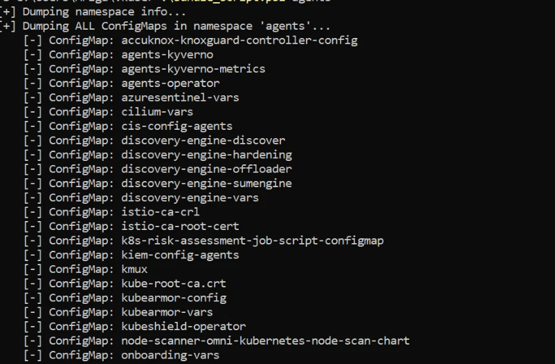

# CWPP Troubleshooting

If the user faces any issue related to clusters, then they should provide the logs information of their clusters for troubleshooting purposes. To streamline the process, we now provide a single command that customers can run in their environment. This collects all required details— logs, errors and configurations—in one go, speeding up diagnosis and resolution.

## Script to automate this process

- This script collects everything needed to debug an issue in a namespace and packages it into a single .tar.gz file.

-Available in two formats: Shell script and Powershell Script.

## Shell Script:

```sh
#!/bin/sh
set -e


if [ $# -lt 1 ]; then
    echo "[!] No namespace provided. Using 'default'"
    NAMESPACE="default"
else
    NAMESPACE="$1"
    shift
fi
DEPLOYMENTS="$*"

if ! kubectl get ns "$NAMESPACE" >/dev/null 2>&1; then
    echo "[ERROR] Namespace '$NAMESPACE' does NOT exist."
    exit 1
fi

TIMESTAMP=$(date +"%Y%m%d-%H%M%S")
OUTPUT_DIR="support_bundle_${NAMESPACE}_${TIMESTAMP}"
mkdir -p "$OUTPUT_DIR"

kctl() {
    kubectl "$@" 2>/dev/null || true
}

dump_namespace() {
    echo "[+] Dumping namespace info..."
    kctl get ns "$NAMESPACE" -o yaml > "$OUTPUT_DIR/namespace.yaml"
}

dump_all_configmaps() {
    echo "[+] Dumping ALL ConfigMaps in namespace '$NAMESPACE'..."
    mkdir -p "$OUTPUT_DIR/configmaps_all"

    ALL_CMS=$(kctl get configmaps -n "$NAMESPACE" --no-headers -o custom-columns=":metadata.name")

    for cm in $ALL_CMS; do
        [ -n "$cm" ] || continue
        echo "    [-] ConfigMap: $cm"
        kctl get configmap "$cm" -n "$NAMESPACE" -o yaml > "$OUTPUT_DIR/configmaps_all/$cm.yaml"
    done
}


dump_pod() {
    POD="$1"
    OUT_DIR="$2"

    mkdir -p "$OUT_DIR"
    echo "    [-] Pod: $POD"

    kctl get pod "$POD" -n "$NAMESPACE" -o yaml > "$OUT_DIR/pod.yaml"
    kctl describe pod "$POD" -n "$NAMESPACE" > "$OUT_DIR/pod_describe.txt"
    kctl get events -n "$NAMESPACE" --field-selector involvedObject.name="$POD" > "$OUT_DIR/events.txt"

    containers=$(kctl get pod "$POD" -n "$NAMESPACE" -o jsonpath='{.spec.containers[*].name}')
    init_containers=$(kctl get pod "$POD" -n "$NAMESPACE" -o jsonpath='{.spec.initContainers[*].name}')

    for c in $containers; do
        echo "         |- container: $c"
        kctl logs "$POD" -n "$NAMESPACE" -c "$c" > "$OUT_DIR/logs_${c}.txt"
        kctl logs "$POD" -n "$NAMESPACE" -c "$c" --previous > "$OUT_DIR/logs_${c}_previous.txt"
    done

    for c in $init_containers; do
        echo "         |- initContainer: $c"
        kctl logs "$POD" -n "$NAMESPACE" -c "$c" > "$OUT_DIR/init_logs_${c}.txt"
    done
}

dump_all_pods() {
    echo "[+] No deployments provided. Dumping ALL pods in '$NAMESPACE'..."

    ALL_PODS=$(kctl get pods -n "$NAMESPACE" --no-headers -o custom-columns=":metadata.name")
    mkdir -p "$OUTPUT_DIR/pods"

    for P in $ALL_PODS; do
        [ -n "$P" ] || continue
        POD_DIR="$OUTPUT_DIR/pods/$P"
        dump_pod "$P" "$POD_DIR"
    done
}

dump_deployments() {
    echo "[+] Dumping deployments: $DEPLOYMENTS"

    for DEPLOY in $DEPLOYMENTS; do
        [ -n "$DEPLOY" ] || continue
        DEPLOY_DIR="$OUTPUT_DIR/deployments/$DEPLOY"
        mkdir -p "$DEPLOY_DIR"

        echo "[*] Deployment: $DEPLOY"

        kctl get deploy "$DEPLOY" -n "$NAMESPACE" -o yaml > "$DEPLOY_DIR/deployment.yaml"
        kctl describe deploy "$DEPLOY" -n "$NAMESPACE" > "$DEPLOY_DIR/deployment_describe.txt"

        PODS=$(kctl get pods -n "$NAMESPACE" -l app="$DEPLOY" --no-headers -o custom-columns=":metadata.name")

        [ -n "$PODS" ] || {
            echo "    [!] No pods found for deployment: $DEPLOY"
            continue
        }

        for P in $PODS; do
            POD_DIR="$DEPLOY_DIR/pods/$P"
            dump_pod "$P" "$POD_DIR"
        done
    done
}


create_archive() {
    echo "[+] Creating archive..."
    tar -czf "${OUTPUT_DIR}.tar.gz" "$OUTPUT_DIR"
    rm -rf "$OUTPUT_DIR"
    echo "    [-] Archive: $(pwd)/${OUTPUT_DIR}.tar.gz"
}


dump_namespace
dump_all_configmaps

if [ -z "$DEPLOYMENTS" ]; then
    dump_all_pods
else
    dump_deployments
fi

create_archive
echo "[+] Dump completed!!!"

```

Save the above file in your working directory as script.sh or any name as required.

**Note:** Need to install zip as a pre-requisite in linux before running the above script.

```sh
sudo apt install zip
```

## Run the script and fetch logs
After saving the above script in your working directory, follow the below steps.

### Make the script executable

```sh
chmod +x script.sh
```
### Create alias for kubectl command

```sh
alias kctl=kubectl
```
### Run the script for desired namespace 

```sh
./script.sh <namespace>
```
**Example:**

```sh
./script.sh agents
```

# 2. Powershell Script

```sh
param(
    [Parameter(Position=0)]
    [string]$Namespace = "default",

    [Parameter(Position=1, ValueFromRemainingArguments=$true)]
    [string[]]$Deployments
)

$ErrorActionPreference = "Continue"

if (-not $Namespace) {
    Write-Host "[!] No namespace provided. Using 'default'"
    $Namespace = "default"
}

# Validate namespace
kubectl get ns $Namespace *> $null
if ($LASTEXITCODE -ne 0) {
    Write-Host "[ERROR] Namespace '$Namespace' does NOT exist."
    exit 1
}

# Timestamp
$Timestamp = Get-Date -Format "yyyyMMdd-HHmmss"
$OutputDir = "support_bundle_${Namespace}_${Timestamp}"

New-Item -ItemType Directory -Force -Path $OutputDir | Out-Null


function Dump-Namespace {
    Write-Host "[+] Dumping namespace info..."
    kubectl get ns $Namespace -o yaml | Out-File "$OutputDir/namespace.yaml"
}

function Dump-AllConfigMaps {

    Write-Host "[+] Dumping ALL ConfigMaps in namespace '$Namespace'..."

    $cmDir = "$OutputDir/configmaps_all"
    New-Item -ItemType Directory -Force -Path $cmDir | Out-Null

    $cms = kubectl get configmaps -n $Namespace `
        --no-headers `
        -o custom-columns=":metadata.name"

    foreach ($cm in $cms) {

        if ([string]::IsNullOrWhiteSpace($cm)) { continue }

        Write-Host "    [-] ConfigMap: $cm"

        kubectl get configmap $cm -n $Namespace -o yaml |
            Out-File "$cmDir/$cm.yaml"
    }
}

function Dump-Pod {

    param(
        [string]$Pod,
        [string]$OutDir
    )

    New-Item -ItemType Directory -Force -Path $OutDir | Out-Null

    Write-Host "    [-] Pod: $Pod"

    kubectl get pod $Pod -n $Namespace -o yaml |
        Out-File "$OutDir/pod.yaml"

    kubectl describe pod $Pod -n $Namespace |
        Out-File "$OutDir/pod_describe.txt"


    $events = kubectl get events -n $Namespace `
        --field-selector involvedObject.name=$Pod `
	--ignore-not-found `
	 2>$null

    if ($events) {  $events | Out-File "$OutDir/events.txt" }


    $containers = kubectl get pod $Pod -n $Namespace `
        -o jsonpath='{.spec.containers[*].name}'

    if ($containers) {

    	foreach ($c in $containers.Split(" ")) {

        	if ([string]::IsNullOrWhiteSpace($c)) { continue }
		
		Write-Host "        [-] container $c"

        	$logs = kubectl logs $Pod -n $Namespace -c $c `
			2>$null 
            	if ($logs) { $logs | Out-File "$OutDir/logs_${c}.txt" }


        	$plogs = kubectl logs $Pod -n $Namespace -c $c --previous `
			2>$null
            	if ($plogs) { $plogs | Out-File "$OutDir/logs_${c}_previous.txt" }

    	}

    	$initContainers = kubectl get pod $Pod -n $Namespace `
        	-o jsonpath='{.spec.initContainers[*].name}'

    	if ($initContainers) {
    		foreach ($ic in $initContainers.Split(" ")) {

        		if ([string]::IsNullOrWhiteSpace($ic)) { continue }
			Write-Host "        [-] initContainer $ic"

        		$logs = kubectl logs $Pod -n $Namespace -c $ic `
				2>$null
            		if ($logs) { $logs | Out-File "$OutDir/init_logs_${c}.txt" }
    		}
    	}
    } else {
	Write-Host "    [-] No containers"	
   }
}

function Dump-AllPods {

    Write-Host "[+] No deployments provided. Dumping ALL pods in '$Namespace'..."

    $podBaseDir = "$OutputDir/pods"
    New-Item -ItemType Directory -Force -Path $podBaseDir | Out-Null

    $pods = kubectl get pods -n $Namespace `
        --no-headers `
        -o custom-columns=":metadata.name"

    foreach ($p in $pods) {

        if ([string]::IsNullOrWhiteSpace($p)) { continue }

        Dump-Pod $p "$podBaseDir/$p"
    }
}

function Dump-Deployments {

    Write-Host "[+] Dumping deployments: $($Deployments -join ', ')"

    foreach ($deploy in $Deployments) {

        if ([string]::IsNullOrWhiteSpace($deploy)) { continue }

        $deployDir = "$OutputDir/deployments/$deploy"

        New-Item -ItemType Directory -Force -Path $deployDir | Out-Null

        Write-Host "[*] Deployment: $deploy"

        kubectl get deploy $deploy -n $Namespace -o yaml |
            Out-File "$deployDir/deployment.yaml"

        kubectl describe deploy $deploy -n $Namespace |
            Out-File "$deployDir/deployment_describe.txt"

        $pods = kubectl get pods -n $Namespace `
            -l app=$deploy `
            --no-headers `
            -o custom-columns=":metadata.name"

        if (-not $pods) {
            Write-Host "    [!] No pods found for deployment: $deploy"
            continue
        }

        foreach ($p in $pods) {

            if ([string]::IsNullOrWhiteSpace($p)) { continue }

            Dump-Pod $p "$deployDir/pods/$p"
        }
    }
}

function Create-Archive {

    Write-Host "[+] Creating archive..."

    tar -czf "${OutputDir}.tar.gz" $OutputDir

    Remove-Item -Recurse -Force $OutputDir

    Write-Host "    [-] Archive: $(Get-Location)/${OutputDir}.tar.gz"
}

# Main execution

Dump-Namespace
Dump-AllConfigMaps

if (-not $Deployments -or $Deployments.Count -eq 0) {

    Dump-AllPods

}
else {

    Dump-Deployments
}

Create-Archive

Write-Host "[+] Dump completed!!!"

```
Save the above file in your working directory as bundle_script.ps1 or any name as required.

## Run the script and fetch logs
After saving the above script in your working directory, follow the below steps.

-Get kubeconfig of your the cluster.

-Navigate to the desired directory in powershell
**Example:**
```sh
cd C:\Users\Mriga\.kube
```
-Create/ Overwrite existing kube config file with that of your cluster

```sh
notepad C:\Users\Mriga\.kube\config
```
-Start SSH tunnel in another terminal and keep the existing one open

-Test kubectl from powershell

```sh
kubectl get pods -A
```

-Run the script from powershell for desired namespace

```sh
.\bundle_script.ps1 <namespace>
```
**Example:**
```sh
.\bundle_script.ps1 agents
```

### Output



- - -
[SCHEDULE DEMO](https://www.accuknox.com/contact-us){ .md-button .md-button--primary }